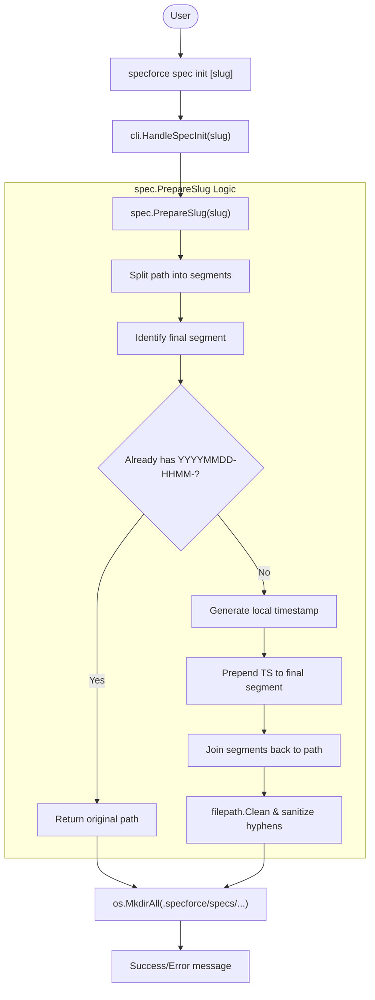

# Design: Auto-Timestamped Spec Slugs

## 1. System Architecture & Flow

The "Auto-Timestamped Spec Slugs" feature integrates into the `specforce spec init` command flow. It intercepts the user-provided slug and applies a transformation before the directory is created on the filesystem.

### 1.1 Logical Flow (Mermaid)



## 2. Threat Modeling & Security

### 2.1 Input Validation & Path Traversal
- **Risk:** User-provided slugs containing `../` or absolute paths could attempt to write outside the `.specforce/specs/` directory.
- **Mitigation:**
    - The system MUST use `filepath.Join(projectRoot, ".specforce", "specs", slug)` which, combined with `filepath.Clean`, reduces traversal risk.
    - `spec.PrepareSlug` will strictly validate that the resulting path is relative and does not contain illegal characters for the target OS.

### 2.2 Shell Injection
- **Risk:** N/A for this feature, as it only involves directory creation and string manipulation.

## 3. Data & Persistence

This feature does not introduce new database schemas or persistent state beyond the filesystem structure.

### 3.1 Filesystem Changes
- **Target Location:** `.specforce/specs/`
- **Structure:** 
    - Input: `my-feature` -> Output: `.specforce/specs/20260504-1158-my-feature/`
    - Input: `team-a/api` -> Output: `.specforce/specs/team-a/20260504-1158-api/`

## 4. API Contracts & Interfaces

### 4.1 Internal Go Interface

A new helper function will be introduced in the `spec` package:

```go
package spec

// PrepareSlug transforms a raw slug (or path) into a timestamped version.
// Format: [path/]YYYYMMDD-HHMM-slug
func PrepareSlug(rawSlug string) string
```

## 5. Implementation Strategy

### 5.1 Slug Transformation Rules
1. **Format:** `YYYYMMDD-HHMM-` (e.g., `20240520-1430-`).
2. **Regex Guard:** `^\d{8}-\d{4}-` will be used to detect existing timestamps.
3. **Double Hyphen Prevention:** Replace `--` with `-` if prepending to a slug starting with a hyphen.
4. **Local Time:** Use `time.Now()` without explicit UTC conversion to respect the developer's local context.

### 5.2 File Inventory

| File | Responsibility |
| :--- | :--- |
| `src/internal/spec/slug.go` | **NEW**: Core logic for `PrepareSlug`. |
| `src/internal/spec/slug_test.go` | **NEW**: Unit tests for happy paths, sub-directories, and edge cases. |
| `src/internal/cli/spec.go` | **MOD**: Update `HandleSpecInit` to call `spec.PrepareSlug` before directory creation. |
| `src/internal/core/errors.go` | **MOD**: (Optional) Add `ErrInvalidSlugFormat` if strict validation is added. |

## 6. Observability & Resilience

### 6.1 Feedback
- The CLI MUST print the final resolved path so the user is aware of the generated timestamp.
- Example: `[OK] Spec directory initialized: .specforce/specs/20260504-1158-my-feature`

### 6.2 Race Conditions
- Since `spec.SpecExists` is called before `os.MkdirAll`, a minor race condition exists if two `init` commands run at the exact same second with the same slug. `os.MkdirAll` will handle this gracefully (no-op if exists, but we return an error if `SpecExists` was true).
