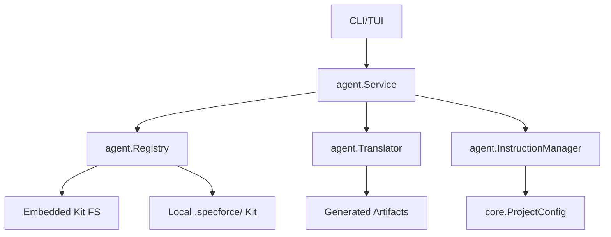

# Technical Design: Reorganized Agents & Skills Structure (v1.x)

## 1. Architecture Blueprint

## 2. API & Interfaces (The Contract)

### Internal API: `agent.Registry`
- `Initialize(embeddedFS fs.FS, rootDir string) error`: Discovers agents and skills from both embedded and local sources.
- `GetAgent(id string) (AgentMetadata, bool)`: Returns agent metadata including its discovery target.
- `GetSkills() []SkillMetadata`: Returns all available skills.

### Internal API: `agent.InstructionManager`
- `GetInstructions(category string, ctx map[string]string) (string, error)`: Fetches instructions and performs variable replacement using `{{key}}` syntax.

## 3. File & Component Inventory

**Backend:**
- `[src/internal/agent/registry.go]` -> Refactor to support multi-source discovery (Embedded + Local `.specforce/`).
- `[src/internal/agent/translator.go]` -> Refactor `resolveMappings` and `AdaptArtifacts` to be fully data-driven. Remove `globalEnabledAgents` hardcoding; move to `kit.yaml` security metadata.
- `[src/internal/agent/instructions.go]` -> (New) Handle dynamic instruction fetching, template parsing, and variable injection.
- `[src/internal/agent/kit/kit.yaml]` -> Standardize v1.x schema with default mappings and security flags.
- `[src/internal/core/config.go]` -> Add `Context` field to `ProjectConfig` for global variable injection.

**Configuration:**
- `[.specforce/config.yaml]` -> Update example with `context` and `instructions` blocks.

**Documentation:**
- `[docs/en/configuration.md]` -> Add "Instruction Variable Injection" section.
- `[docs/pt/configuration.md]` -> (Optional/Translation) Mirror changes.
