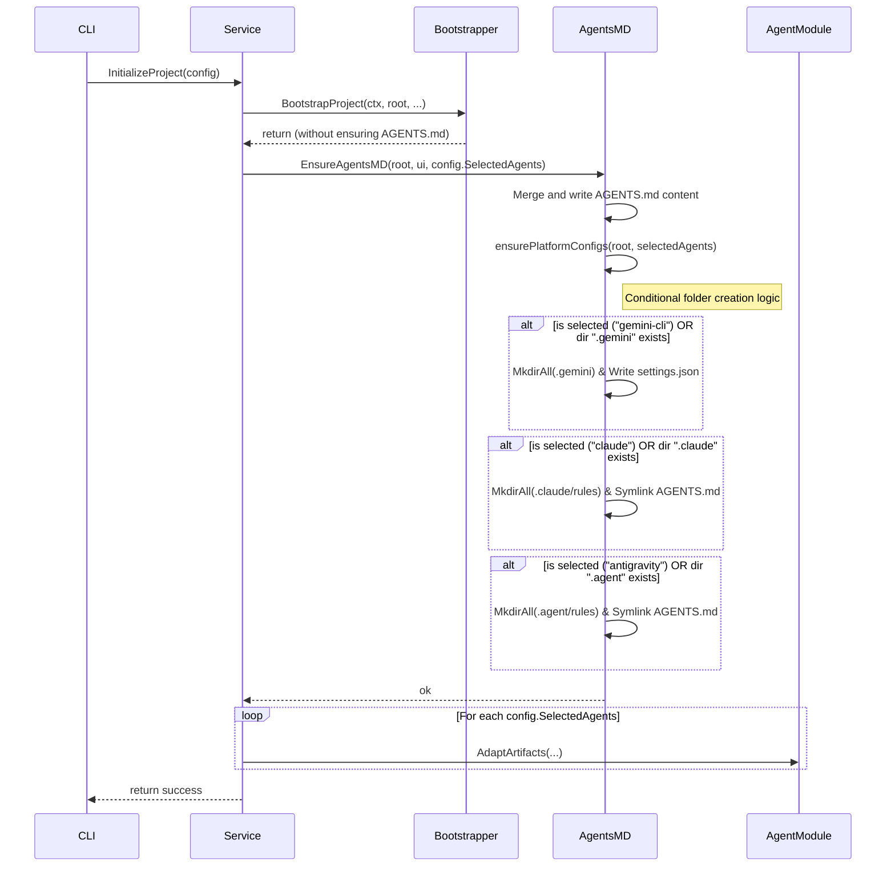

# Technical Design: Fix tool folder creation during init

## 1. Architecture Blueprint

The current implementation of project initialization unconditionally creates tool-specific folders (`.gemini/`, `.claude/`, `.agent/`) and their respective configuration files and symlinks. This behavior occurs because `EnsureAgentsMD` calls `ensurePlatformConfigs` without knowing which agents were actually selected by the user. Furthermore, `BootstrapProject` calls `EnsureAgentsMD` directly, before any agent selection is processed.

To resolve this, we will remove the `EnsureAgentsMD` call from `BootstrapProject`. Instead, the `Service` (which orchestrates the initialization and knows the `SelectedAgents`) will invoke `EnsureAgentsMD` directly, passing the selected agents. The `ensurePlatformConfigs` function will then conditionally create these folders and configs based on the user's selection or the pre-existence of the directories.

## 2. Persistence & Data Modeling
*(Omitted)*

## 3. API & Interfaces (The Contract)

### 3.1 `src/internal/project/agents_md.go`
*   **Modified Function:** `EnsureAgentsMD(root string, ui core.UI, selectedAgents []string) error`
*   **Modified Function:** `ensurePlatformConfigs(root string, selectedAgents []string) error`

### 3.2 `src/internal/project/bootstrapper.go`
*   **Modified Function:** `BootstrapProject(...) error`

### 3.3 `src/internal/project/service.go`
*   **Modified Function:** `InitializeProject(ctx context.Context, ui core.UI, config InitConfig) error`
*   **Modified Function:** `UpdateTools(ctx context.Context, ui core.UI, selectedAgents []string) error`

## 4. File & Component Inventory

**Backend:**
- `src/internal/project/agents_md.go` -> Conditional directory and config generation.
- `src/internal/project/bootstrapper.go` -> Remove premature call to EnsureAgentsMD.
- `src/internal/project/service.go` -> Trigger EnsureAgentsMD with selected agents.
- `src/internal/project/agents_md_test.go` -> Test conditional logic.
- `src/internal/project/bootstrapper_test.go` -> Update test mock calls.
