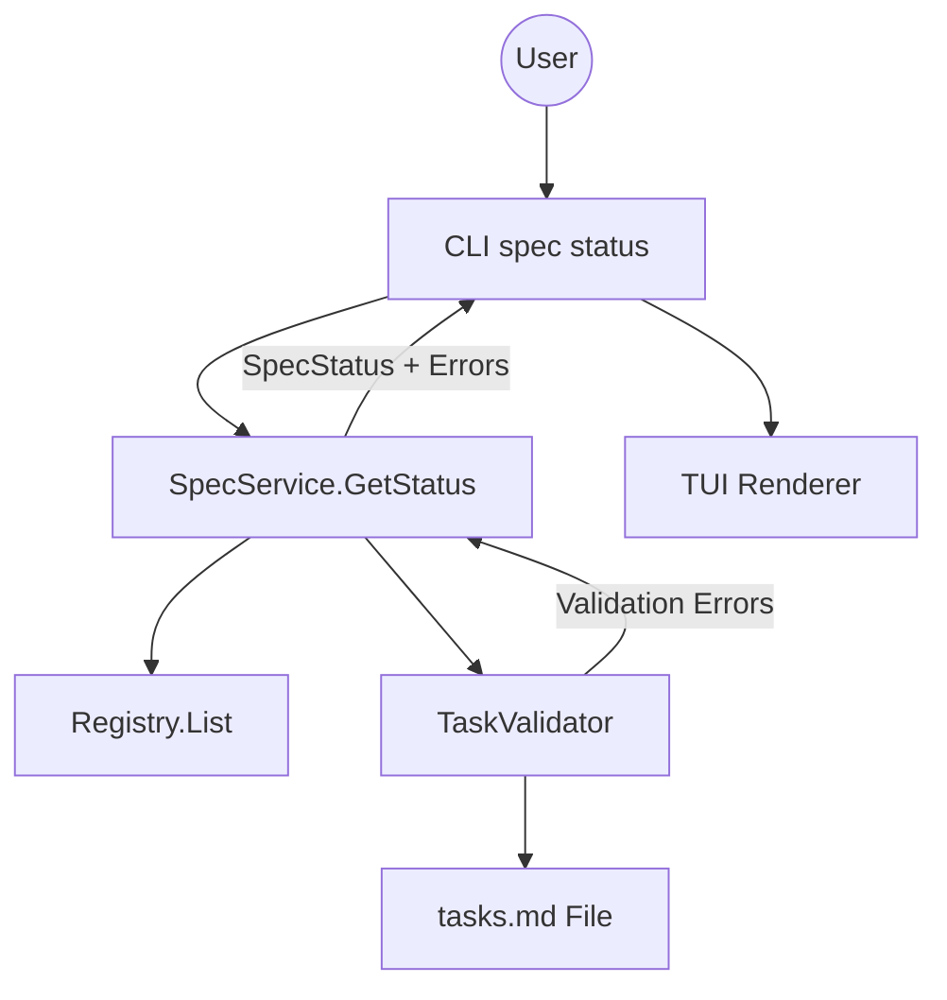

# Technical Design: Tasks Markdown Validation in Status

## 1. Architecture Blueprint

The validation logic will be integrated into the `GetStatus` workflow. When `spec status` is called, the system will not only check for file existence but also perform a structural analysis of `tasks.md` if it exists.



## 3. API & Interfaces (The Contract)

### Data Model Updates

**ArtifactStatus (src/internal/spec/status.go)**
```go
type ArtifactStatus struct {
    // ... existing fields
    ValidationErrors []string `json:"validation_errors,omitempty"`
}
```

**SpecStatus (src/internal/spec/status.go)**
```go
type SpecStatus struct {
    // ... existing fields
    IsValid bool `json:"is_valid"`
}
```

### New Internal Interface (TaskValidator)

**ValidateTasks (src/internal/spec/tasks.go)**
```go
func ValidateTasks(ctx context.Context, projectRoot, slug string) ([]string, error)
```

## 4. File & Component Inventory

**Backend:**
- `src/internal/spec/status.go` -> Update `ArtifactStatus` and `SpecStatus` structs. Update `GetStatus` to invoke validation for the `tasks` artifact.
- `src/internal/spec/tasks.go` -> Implement `ValidateTasks` logic. This function will perform an exhaustive parse of `tasks.md` and check for:
    - **Global Structure:** Task headers appearing before any Phase header.
    - **Naming & Order:** Task IDs matching parent Phase, sequentiality (T1.1, T1.2...), and ID format.
    - **Task Block Completeness:** Each task block MUST contain:
        - `**Target:**` field.
        - `**Context:**` field.
        - `**Action Steps:**` section with at least one list item.
        - `**Verification (TDD):**` section with content.
    - **Empty Phases:** Phases with no associated tasks.
- `src/internal/cli/spec.go` -> Update `renderSpecStatusTUI` to detect `ValidationErrors` and display them clearly.

**TUI (src/internal/tui/):**
- `src/internal/tui/console.go` -> (If needed) add a helper for rendering error lists.
