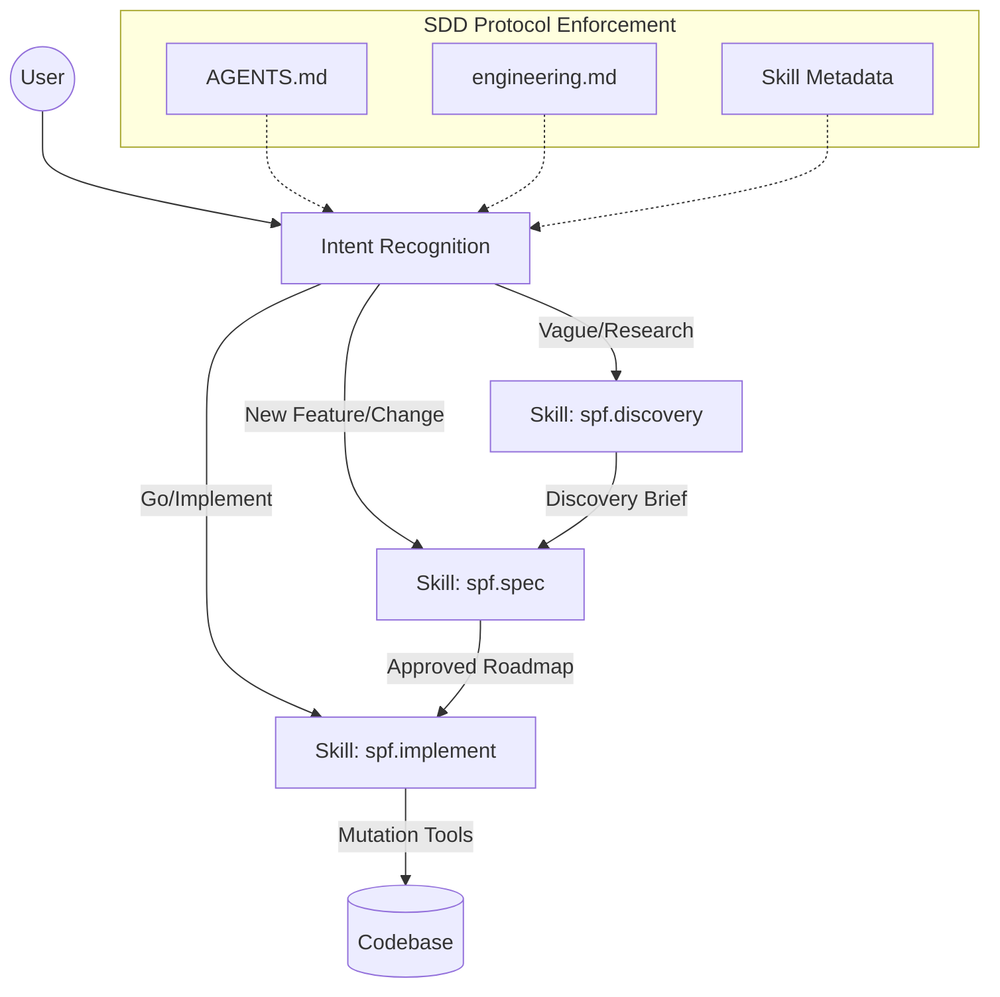

# Technical Design: Protocol Trigger Optimization

## 1. Architecture Blueprint

## 2. File & Component Inventory

**Configuration & Rules:**
- `[AGENTS.md]` -> Update the "Proactive Mandate" and "Spec-Driven Development (SDD) Protocol" sections with explicit trigger conditions and prohibition of direct edits.
- `[.specforce/docs/engineering.md]` -> Clarify the "Primary Orchestration Only" rule to distinguish between Specforce skills and native LLM planning modes.

**Source Templates & Kit:**
- `[src/internal/project/agents_md.go]` -> Update the `agentsMDTemplate` constant to match the new `AGENTS.md` standard. This ensures new projects and `specforce init` commands propagate the updated protocol.
- `[src/internal/agent/kit/commands/discovery.yaml]` -> Update `description` with keywords: "brainstorm", "research", "diagnose", "bug investigation", "root cause analysis", and "vague intent".
- `[src/internal/agent/kit/commands/spec.yaml]` -> Update `description` with keywords: "plan", "initialize", "update specs", and "formalize".
- `[src/internal/agent/kit/commands/implement.yaml]` -> Ensure `description` emphasizes "deterministic execution" and "approved roadmap".

## 3. Implementation Strategy
1. Update `AGENTS.md` and `engineering.md` first to establish the new rules for the current session.
2. Update the Go template in `src/internal/project/agents_md.go` to persist the changes for future generations.
3. Update the source YAML files in `src/internal/agent/kit/commands/` to update skill/command metadata across all agents.
