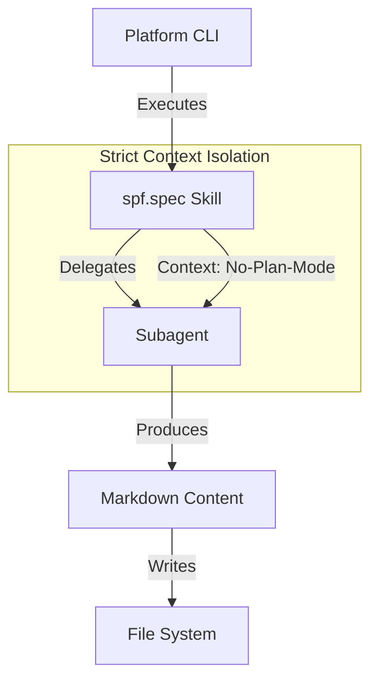

# Technical Design: Fix Inadvertent Plan Mode Activation

## 1. Architecture Blueprint

## 2. File & Component Inventory

**Skills & Commands:**
- `src/internal/agent/kit/commands/spec.yaml` -> Update Rule #3 to prohibit platform-native planning and reinforce sovereign workflow. Update Step 2.B to inject "No-Plan-Mode" directive in subagent delegations.

**Agents:**
- `src/internal/agent/kit/agents/technical-solution-architect.yaml` -> Add "Atomic Execution" guardrail to prevent high-level planning modes.
- `src/internal/agent/kit/agents/product-analyst.yaml` -> Add "Atomic Execution" guardrail to prevent high-level planning modes.
- `src/internal/agent/kit/agents/technical-project-planner.yaml` -> Add "Atomic Execution" guardrail to prevent high-level planning modes.
- `src/internal/agent/kit/agents/technical-qa-engineer.yaml` -> Add "Atomic Execution" guardrail to prevent high-level planning modes.
