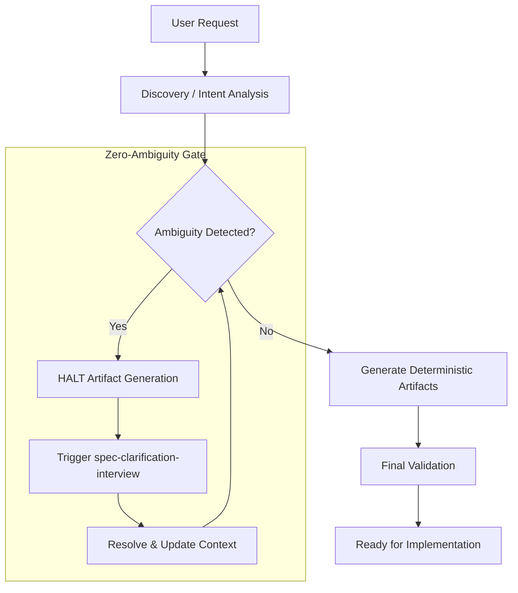

# Technical Design: Zero-Ambiguity SDD Workflow

## 1. Architecture Blueprint
The "Zero-Ambiguity" protocol establishes a hard blocking gate between the Discovery/Planning phase and the generation of implementation-ready artifacts. The system transitions from a permissive "fail-forward" model to a "Halt & Resolve" model.

## 2. Configuration & Logic Changes

### 2.1 Artifact Template Refactoring
Templates located in `src/internal/agent/artifacts/spec/` will be purged of all ambiguity-related sections and updated with mandatory "No-Assumption" instructions.

#### `requirements.yaml`
- **Instruction Change:** Prepend a rule stating: "ASSUMPTIONS PROHIBITED: You MUST NOT make assumptions about business logic. If a rule is missing, you MUST halt and request clarification via the orchestrator."
- **Template Change:** Remove the `3. [Ambiguity]` scenario from the `template` field. All requirements must be defined exclusively by Happy Path and Edge Case scenarios.

#### `design.yaml` & `tasks.yaml`
- **Instruction Change:** Add a rule: "DETERMINISM MANDATE: Every technical decision and implementation step MUST be concrete. Use of 'TBD', 'To be defined', or placeholders is strictly forbidden."

### 2.2 Master Orchestrator (`spf.spec`) logic
The orchestration logic in `src/internal/agent/kit/commands/spec.yaml` will be hardened:
- **Phase 1 (Discovery):** Change "If necessary, use your user-interaction tool to clarify" to "You MUST use your user-interaction tool to clarify ALL technical and business ambiguities before proceeding."
- **Guardrail Addition:** Add a "Zero-Doubt Policy" guardrail: "Any artifact containing a placeholder or ambiguity marker is considered a failure and MUST be regenerated after clarification."

### 2.3 Skill Mandates
Skills will be updated to reflect the new policy:
- **`pragmatic-product-owner`**: Add a "Zero-Ambiguity Mandate" section requiring binary, non-ambiguous ACs.
- **`spec-clarification-interview`**: Update description to emphasize its role as the *mandatory gate* for resolving unknowns before any documentation is finalized.

## 3. File & Component Inventory

### 3.1 Template Updates
- `src/internal/agent/artifacts/spec/requirements.yaml`: Remove ambiguity scenario, add prohibition instruction.
- `src/internal/agent/artifacts/spec/design.yaml`: Add determinism instruction.
- `src/internal/agent/artifacts/spec/tasks.yaml`: Add determinism instruction.

### 3.2 Command & Skill Updates
- `src/internal/agent/kit/commands/spec.yaml`: Update orchestration language from permissive to mandatory.
- `src/internal/agent/kit/skills/pragmatic-product-owner/SKILL.yaml`: Add Zero-Ambiguity Mandate.
- `src/internal/agent/kit/skills/spec-clarification-interview/SKILL.yaml`: Update to reflect mandatory blocking role.

## 4. Observability & Resilience
- **Traceability:** Clarification interview logs MUST be preserved in the session context to ensure that the final artifacts reflect the decisions made.
- **Race Conditions:** In batch processing, if one artifact in the chain (e.g., Requirements) is blocked by ambiguity, all downstream generation (Design, Tasks) MUST be paused until the upstream artifact is resolved and written.
