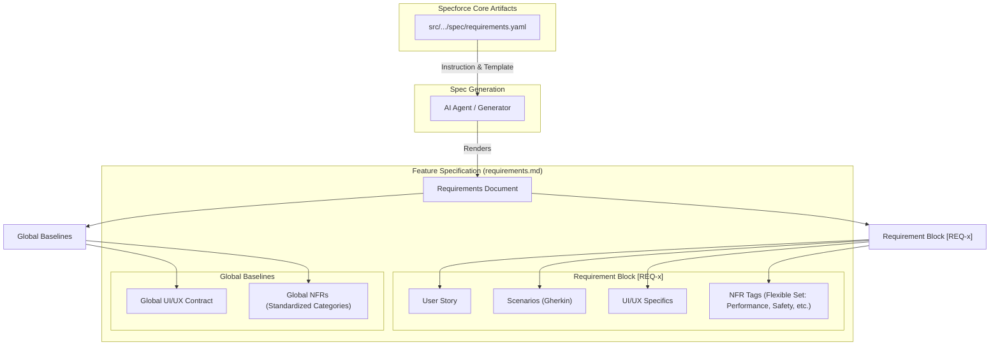

# Technical Design: Granular UI/UX and NFR Sections in Requirements Template

## 1. Architecture Blueprint
The following diagram illustrates how the `requirements.yaml` template governs the structure of the generated `requirements.md` files, ensuring localized context for both functional and non-functional requirements.

## 2. Authorization & Security
- **Data Protection:** The template updates do not introduce new data persistence or access layers.
- **Validation:** The `instruction` field in `requirements.yaml` is updated to enforce the presence of both localized and global UI/UX/NFR sections. This acts as a quality gate for AI-generated specifications.
- **Security-by-Design:** The new `Safety` sub-section in localized NFRs explicitly prompts for data protection and destructive action guards for every requirement.

## 3. Data & Persistence
- **Schema Changes:** No database schema changes.
- **Artifact Update:** The YAML structure of `requirements.yaml` remains consistent, but its string values (`instruction` and `template`) are expanded to include the new hierarchical requirements structure.

## 4. File & Component Inventory
**Backend (Artifacts):**
- `src/internal/agent/artifacts/spec/requirements.yaml`: Update the template and instructions to include localized UI/UX Specifics and Technical Constraints (NFR) in requirements, plus global sections.
    - **Instructions:** Mandatory localized context for every requirement. Explicitly move to a flexible set of NFR categories (Performance, Safety, Observability, etc.) to ensure relevant technical constraints are captured per feature.
    - **Template:** Refactored BDD blocks and new Global sections (UI/UX Contract & NFRs), including specific prompts for Performance baselines.

## 5. Observability & Resilience
- **Traceability:** By localizing NFRs (e.g., "Observability: Log action X") within specific requirements, implementation agents are guided to include necessary instrumentation per feature.
- **Resilience:** Explicit "Safety" constraints in the NFR block of requirements (e.g., "Gifts MUST be confirmed") provide a blueprint for building resilient systems and UIs.
- **Performance:** Localized Performance tags (e.g., "Performance: Latency < 200ms for operation Y") allow for granular performance targets and verification.
- **Error Handling:** Global NFRs now explicitly define reliability and error handling standards to ensure consistent system behavior.
