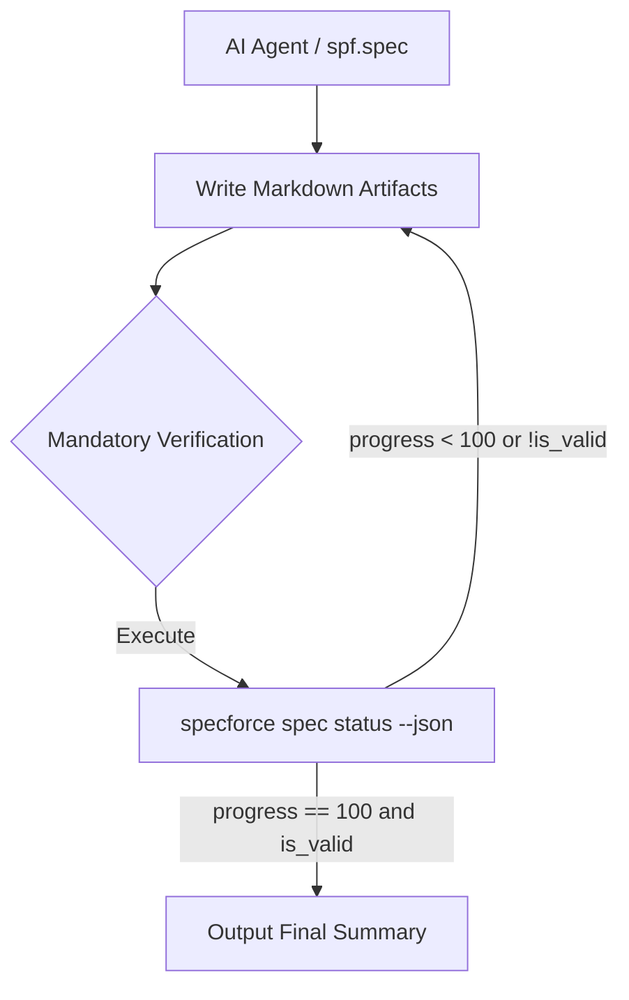

# Technical Design: Hardened Spec Verification

## 1. Architecture Blueprint

## 2. API & Interfaces (The Contract)

### Orcherstration Contract (spec.yaml)
The `src/internal/agent/kit/commands/spec.yaml` file defines the contract between the framework and the AI agent. The "Step 3: Verification & Handoff" section is being updated to enforce strict terminal verification.

## 3. File & Component Inventory

**Configuration:**
- `[src/internal/agent/kit/commands/spec.yaml]` -> Update Step 3 (Verification & Handoff) and Guardrails to enforce the mandatory terminal status verification.
