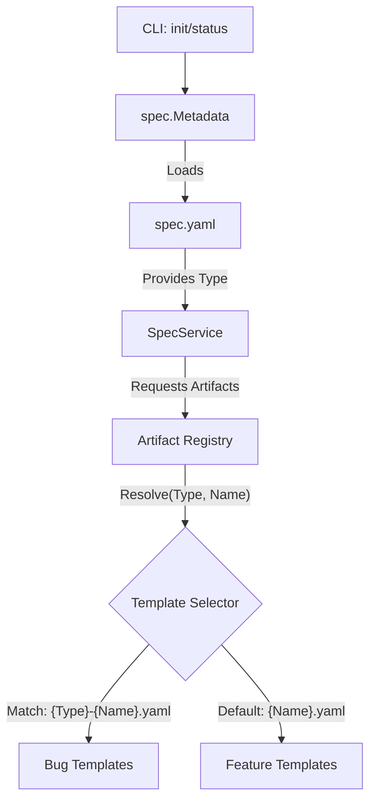

# Technical Design: Specialized Bugfix Templates

## 1. Architecture Blueprint
*Metadata-driven artifact resolution flow.*



## 2. API & Interfaces (Internal Contracts)

### Metadata Management (`src/internal/spec/metadata.go`)
```go
type Metadata struct {
    Slug string `yaml:"slug"`
    Name string `yaml:"name"`
    Type string `yaml:"type"` // "feature" | "bug"
}

func LoadMetadata(projectRoot, slug string) (*Metadata, error)
func SaveMetadata(projectRoot, slug string, meta *Metadata) error
```

### Registry Enhancements (`src/internal/spec/registry.go`)
```go
// Artifact structure remains same, but Registry changes how it retrieves them.
func (r *Registry) GetForType(typeName, artifactName string) (Artifact, bool)
func (r *Registry) ListForType(typeName string) []Artifact
```

### Service Layer Updates (`src/internal/spec/service.go`)
- `GetStatus(ctx, projectRoot, slug)`: Now loads metadata first to filter the registry list.
- `GetArtifact(ctx, artifactName)`: If called within a spec context, uses the spec type to resolve the specific template.

## 3. File & Component Inventory

**Core Logic:**
- `[src/internal/spec/metadata.go]` -> New: Handle `spec.yaml` lifecycle.
- `[src/internal/spec/registry.go]` -> Modify: Add type-aware retrieval logic (checking for `{type}-{name}.yaml`).
- `[src/internal/spec/status.go]` -> Modify: Integrate metadata loading into the status scanning loop.
- `[src/internal/cli/spec.go]` -> Modify: Add `--type` flag to `init` and update `status` TUI to display the spec type.

**Artifacts (Embedded):**
- `[src/internal/agent/artifacts/spec/bug-requirements.yaml]` -> New: Bugfix-focused instructions and template.
- `[src/internal/agent/artifacts/spec/bug-design.yaml]` -> New: Bugfix-focused design template (RCA, Regression).

## 4. Execution Strategy
1. **Metadata Foundation:** Implement `Metadata` struct and persistence.
2. **Registry Evolution:** Update `Registry` to support the `{type}-{name}` naming convention.
3. **Command Implementation:** Update `spec init` to create `spec.yaml`.
4. **Status Integration:** Update `spec status` to be type-aware.
5. **Artifact Injection:** Add the new `bug-*` artifacts to the embedded filesystem.
