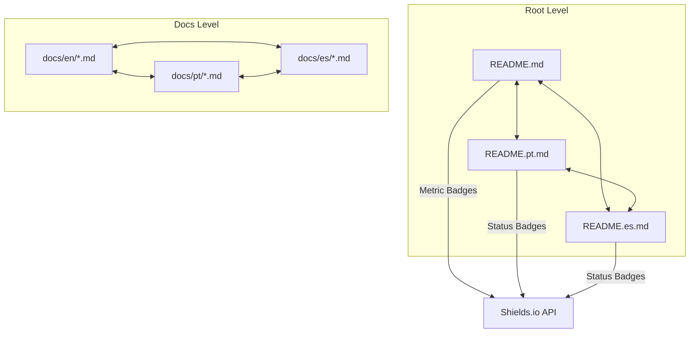

# Technical Design: Shields.io and Multi-Language Navigation

## 1. Architecture Blueprint

The documentation navigation system follows a decentralized, static linking model. Every markdown file acts as a node with pre-defined relative links to its counterparts in other languages.



## 2. File & Component Inventory

This feature involves updating 21 files (3 READMEs + 18 documentation files).

### Documentation Navigation Pattern
Every file in `docs/{lang}/*.md` will receive the following header (example for `docs/en/cli.md`):
```markdown
# CLI Reference
[ [English](cli.md) | [Português](../pt/cli.md) | [Español](../es/cli.md) ]
```

### README Badge Layout
The top section of `README.md`, `README.pt.md`, and `README.es.md` will be standardized:

**Metrics Block (Primary README only):**
```markdown
<p align="center">
  <a href="https://github.com/jeancodogno/specforce-kit/releases"></a>
  <a href="https://github.com/jeancodogno/specforce-kit/actions/workflows/ci.yml"></a>
  <a href="https://goreportcard.com/report/github.com/jeancodogno/specforce-kit"></a>
  <a href="https://www.npmjs.com/package/@jeancodogno/specforce-kit"></a>
  <a href="go.mod"></a>
  <a href="https://github.com/jeancodogno/specforce-kit/issues"></a>
  <a href="https://github.com/jeancodogno/specforce-kit/pulls"></a>
  <a href="LICENSE"></a>
</p>
```

**Language Switcher Block (All READMEs):**
```markdown
<p align="center">
  <a href="README.md"></a>
  <a href="README.pt.md"></a>
  <a href="README.es.md"></a>
</p>
```

### Modified Files List:
- `README.md`: Add Metrics and Language Switcher badges.
- `README.pt.md`: Replace text navigation with Language Switcher badges. Add Metrics badges.
- `README.es.md`: Replace text navigation with Language Switcher badges. Add Metrics badges.
- `docs/en/*.md` (6 files): Add relative language navigation header.
- `docs/pt/*.md` (6 files): Add relative language navigation header.
- `docs/es/*.md` (6 files): Add relative language navigation header.

## 3. Interaction Constraints
- **Relative Linking:** All links within the `docs/` folder must use relative paths (e.g., `../pt/filename.md`) to ensure they work correctly in both GitHub UI and local clones.
- **Badge Consistency:** All Shields.io badges MUST use `?style=flat-square` to match the project's modern aesthetic.
- **Alt Text:** Every badge must have descriptive alt text for accessibility.
