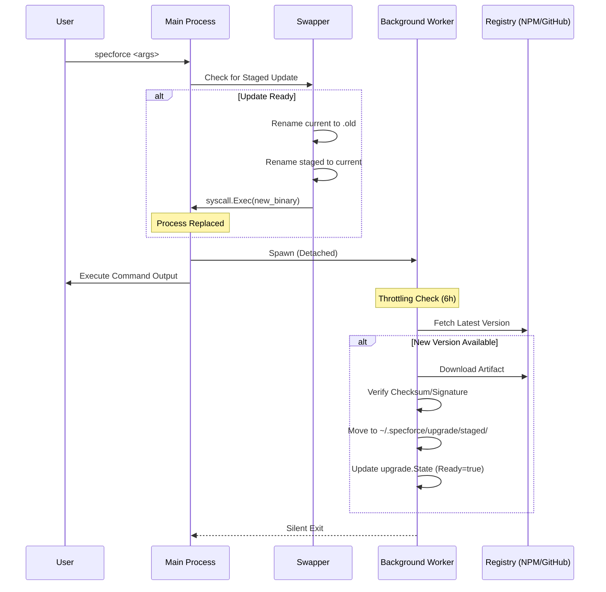

# Technical Design: Automated Background Updates

This design implements a non-blocking, two-phase update system that ensures Specforce Kit stays current with zero friction for the user.

## 1. System Architecture

## 2. Persistence - State & Directory Structure

### Staging Directory
All update artifacts are isolated from the active installation until the swap phase.
- **Path:** `~/.specforce/upgrade/staged/`
- **Content:** `specforce_next` (The verified binary or package)

### upgrade.State
Managed in `~/.specforce/upgrade/state.json`.

| Field | Type | Description |
| :--- | :--- | :--- |
| `LastCheck` | `time.Time` | Timestamp of last registry query (for 6h throttling). |
| `StagedVersion` | `string` | Semantic version of the binary currently in the staged directory. |
| `UpdateReady` | `bool` | Flag indicating the Startup phase should perform the swap. |
| `InstallMethod` | `string` | `binary` or `npm`, detected at runtime. |

## 3. Atomic Swap Pattern: 'Rename-to-Old'

To ensure the binary is never in a corrupted state, we use the following atomic transition during the **Startup Phase**:

1. **Detection:** Main process (`main.go`) reads `upgrade.State`. If `UpdateReady == true`:
2. **Path Resolution:** Identify `ActiveBinaryPath` (via `os.Executable()`).
3. **The Swap:**
    - `os.Rename(ActiveBinaryPath, ActiveBinaryPath + ".old")`
    - `os.Rename(StagedPath, ActiveBinaryPath)`
    - *Note:* Fallback to Copy + Delete is implemented in `moveFile` to handle cross-device links (e.g., when `/tmp` and `~/.specforce` are on different partitions).
4. **Execution Transfer:**
    - Use `syscall.Exec(ActiveBinaryPath, os.Args, os.Environ())` on Unix-like systems.
    - On Windows, spawn a detached move-and-restart script or use `exec.Command` and exit.
5. **Cleanup:** The `.old` file is deleted by the *next* successful command run (via `PersistentPreRunE`).

## 4. Multi-Provider Strategy

| Provider | Check Method | Download/Stage Method |
| :--- | :--- | :--- |
| **Binary** | GitHub Releases API (latest) | Download standalone native binary (e.g., `specforce-kit_linux_amd64`), verify SHA256, move to staged. |
| **NPM** | `npm view @specforce/kit version` | `npm install -g @specforce/kit` (Triggered via `exec.Command` in background). |

*Note: For NPM, the "Atomic Swap" is largely handled by the package manager, but Specforce manages the notification and the background trigger logic.*

## 5. File Inventory

| File Path | Responsibility |
| :--- | :--- |
| `src/internal/upgrade/service.go` | **Orchestrator:** Entry point for background triggers. Manages throttling logic and provider selection. |
| `src/internal/upgrade/state.go` | **Persistence:** Handles reading/writing the `state.json` file. Provides thread-safe access to update status. |
| `src/internal/upgrade/semver.go` | **Logic:** Semantic version comparison and normalization. |
| `src/internal/upgrade/installer_binary.go` | **Binary Strategy:** Logic for downloading and verifying GitHub assets. |
| `src/cmd/specforce/main.go` | **Lifecycle:** Entry point that triggers `checkForSwap` and `runInternalUpgradeCheck`. |

## 6. Observability & Resilience

- **Structured Logging:** Every update attempt, failure (network/permissions), and successful swap is logged (accessible via DEBUG=1).
- **Corruption Recovery:** If `syscall.Exec` fails or the new binary crashes on startup, the system should attempt to rollback by restoring the `.old` binary if it exists.
- **Permission Handling:** If the user doesn't have write access to the binary directory, the background process will fail silently or log the error in the internal state.

---
**Status:** [COMPLETED]
