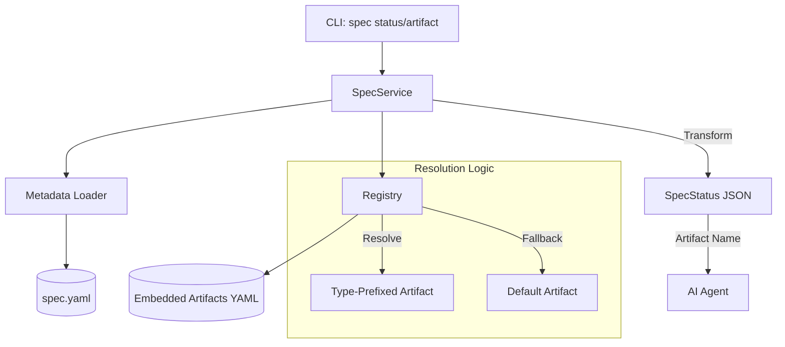

# Technical Design: Spec Type Integration Fix

## 1. Architecture Blueprint



## 2. Persistence & Data Modeling

### Metadata Struct
The `Metadata` struct in `src/internal/spec/metadata.go` is already equipped with the `Type` field. The implementation must ensure that `LoadMetadata` defaults to `"feature"` if the field is missing or the `spec.yaml` file does not exist (backwards compatibility).

### spec.yaml Structure
The `spec.yaml` file remains the source of truth for the spec type:
```yaml
slug: my-feature
name: My Feature
type: feature # or "bug"
```

## 3. API & Interfaces (The Contract)

### SpecStatus JSON Structure
Update the `SpecStatus` struct in `src/internal/spec/status.go` to expose the specification type.

```go
type SpecStatus struct {
	Slug      string           `json:"slug"`
	Type      string           `json:"type"` // Added field
	Artifacts []ArtifactStatus `json:"artifacts"`
	Progress  int              `json:"progress"`
	Total     int              `json:"total"`
	Found     int              `json:"found"`
	IsValid   bool             `json:"is_valid"`
}
```

### ArtifactStatus Name Prefixing
In `src/internal/spec/status.go`, the `GetStatus` and `processArtifactStatus` functions must be updated to prefix the `ArtifactStatus.Name` with the spec type (e.g., `bug-requirements`). 

**Constraint:** The `Path` field in `ArtifactStatus` must remain pointing to the physical base name (e.g., `requirements.md`) to maintain file system consistency.

### Registry Lookup Contract
The `Registry.Get(name)` method in `src/internal/spec/registry.go` must be updated to handle prefixed lookups:
1. Try exact match (e.g., `bug-requirements` if a specialized YAML exists).
2. If name starts with a known prefix (`bug-`, `feature-`), strip it and attempt to load the specialized version for that type using `GetForType`.
3. Fallback to the base artifact (e.g., `requirements`) if no specialized version is found.

## 4. File & Component Inventory

- **src/internal/spec/metadata.go**: 
    - Verify `LoadMetadata` correctly handles default type assignment for legacy specs.
- **src/internal/spec/status.go**: 
    - Update `SpecStatus` struct to include `Type`.
    - Update `GetStatus` to populate the `Type` field.
    - Update `processArtifactStatus` to compute the prefixed `Name` for the JSON response.
- **src/internal/spec/registry.go**:
    - Update `Get(name string)` to implement the "Prefix-then-Base" resolution strategy.
- **src/internal/cli/spec.go**:
    - Update `HandleSpecInit` to enforce valid type validation (`feature`, `bug`) and include it in the TUI/JSON success message.
    - Update `HandleSpecStatus` and `HandleSpecArtifact` to ensure the registry is correctly utilized with prefixed names.
- **src/internal/agent/kit/commands/spec.yaml**:
    - Update the `spf.spec` skill instructions to proactively determine the spec type and use the `--type` flag during `spec init`.
    - Ensure the instructions command the agent to use the prefixed names returned by `spec status --json`.
