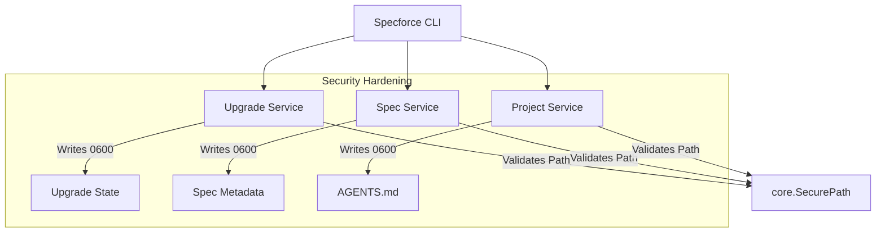

# Technical Design: Security Hardening (v2026-05-08)

## 1. Architecture Blueprint

## 4. File & Component Inventory

**Go Runtime & CI:**
- `[go.mod]` -> Upgrade to `go 1.26.3`
- `[.github/workflows/ci.yml]` -> Update Go version to `1.26.3`
- `[.github/workflows/release.yml]` -> Update Go version to `1.26.3`

**Security Tooling:**
- `[Makefile]` -> Remove global `-exclude=G703,G304,G306` from `security` target.

**File Permissions (REQ-2):**
- `[src/internal/upgrade/state.go]` -> Change `os.WriteFile` permission from `0644` to `0600`.
- `[src/internal/spec/metadata.go]` -> Change `os.WriteFile` permission from `0644` to `0600`.
- `[src/internal/project/agents_md.go]` -> Refine `#nosec` comments for `os.WriteFile` (0600).

**Static Analysis Refinement (REQ-3):**
- `[src/internal/upgrade/service.go]` -> Add `#nosec G304` at `os.Open` sites validated by `core.SecurePath`.
- `[src/internal/upgrade/installer_binary.go]` -> Add `#nosec G304` at `os.Open/os.Create` sites validated by `core.SecurePath`.
- `[src/internal/spec/tasks.go]` -> Add `#nosec G304` at `os.ReadFile` validated by `core.SecurePath`.
- `[src/internal/spec/metadata.go]` -> Add `#nosec G304` at `os.ReadFile` validated by `core.SecurePath`.
- `[src/internal/agent/registry.go]` -> Add `#nosec G304` at `os.ReadFile` (ensure path is validated or bounded).
- `[src/internal/project/agents_md.go]` -> Add `#nosec G703` with justification.
