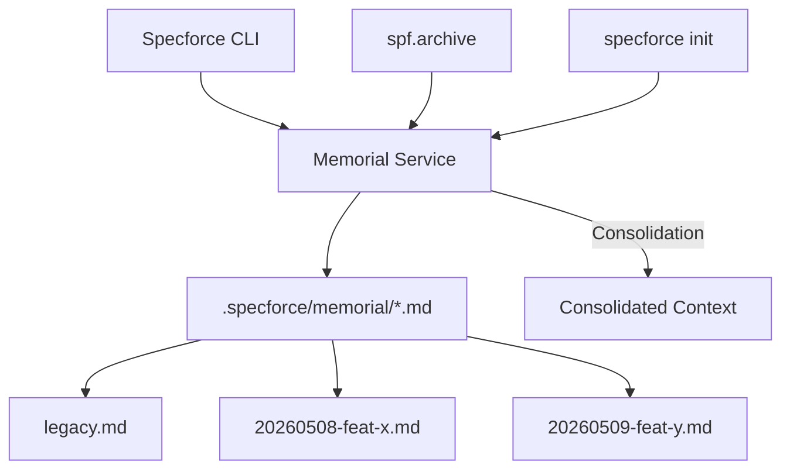

# Technical Design: Distributed Memorial Architecture

## 1. Architecture Blueprint



## 2. Persistence & Data Modeling
The system will shift from a single `memorial.md` file to a directory-based storage in `.specforce/memorial/`.

- **Directory Structure:**
  - `.specforce/memorial/` (0750)
  - `.specforce/memorial/ROUTING.md`: Contains the Rules of Engagement and metadata about the memory structure.
  - `.specforce/memorial/legacy.md`: Migrated content from the old `memorial.md`.
  - `.specforce/memorial/{YYYYMMDD}-{HHMM}-{SLUG}.md`: Individual memory fragments (0600).

- **Fragment Schema (Markdown Frontmatter):**
```markdown
---
date: YYYY-MM-DD
scope: [Feature Slug]
author: [Agent/User]
type: [Action | Lesson | Decision]
---
# [Title]
... content ...
```

## 3. API & Interfaces (The Contract)

### Internal Memorial Service (Go Interface)
```go
type MemorialService interface {
    // Record adds a new fragment to the memorial directory.
    Record(ctx context.Context, fragment Fragment) error
    
    // Consolidate reads the ROUTING.md and the latest N fragments.
    Consolidate(ctx context.Context, limit int) (string, error)
    
    // Initialize sets up the directory and initial ROUTING.md.
    Initialize(ctx context.Context) error
}
```

## 4. File & Component Inventory

**Backend:**
- `src/internal/project/memorial.go` -> New service to manage fragment persistence and consolidation.
- `src/internal/project/bootstrapper.go` -> Modify to create `.specforce/memorial/` directory during `init`.
- `src/internal/project/agents_md.go` -> Update `EnsureAgentsMD` to point agents to the new memorial structure.
- `src/internal/agent/artifacts/constitution/memorial.yaml` -> Update template to reflect the new distributed structure (or remove if handled by service).
- `src/internal/cli/cli.go` -> Update `HandleInit` to call the new Memorial initialization logic.

**Artifacts & Skills:**
- `.specforce/docs/memorial.md` -> To be marked as DEPRECATED or moved during migration.
- `src/internal/agent/kit/instructions/archive.md` -> Update the "Knowledge Harvesting" step to use the new fragment recording logic.
- `.specforce/docs/engineering.md` -> Update reference from `memorial.md` to `.specforce/memorial/` directory.
- `.specforce/docs/governance.md` -> Update reference from `memorial.md` to `.specforce/memorial/` directory.
- `docs/{en,pt,es}/artifacts.md` -> Update description of the Memorial artifact.
- `docs/{en,pt,es}/getting-started.md` -> Update reference to the Memorial update process.
