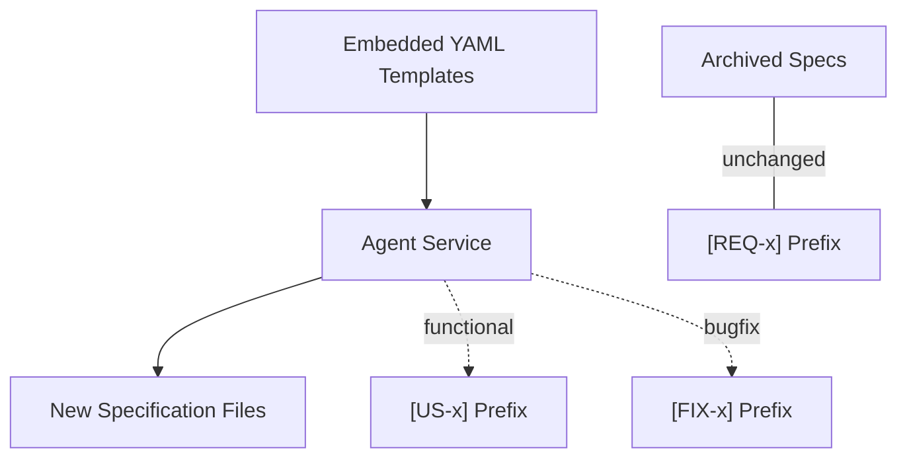

# Technical Design: Replace REQ with US Prefix

## 1. Architecture Blueprint

The change is a modification of the embedded specification templates used by the Agent to generate documentation. The system architecture remains unchanged, but the generated artifacts will now use the industry-standard `[US-x]` (User Story) prefix instead of `[REQ-x]`.

## 2. Persistence & Data Modeling
No changes to the data model or persistence layer are required. The Go core logic for parsing and validating specifications is already prefix-agnostic, relying on the field headers (e.g., `**Context:**`) rather than the prefix string itself.

## 3. API & Interfaces (The Contract)
No changes to external APIs. The contract for generated Markdown files is updated as follows:

| Artifact | Location | Field | Old Prefix | New Prefix |
|---|---|---|---|---|
| `requirements.md` | `## 3. Acceptance Criteria` | Header | `### [REQ-x]` | `### [US-x]` |
| `tasks.md` | `## 2. Tasks` | `**Context:**` | `[REQ-x]` | `[US-x]` |

## 4. File & Component Inventory

### Backend (Templates)
- `src/internal/agent/artifacts/spec/requirements.yaml` -> Update instructions (rule 5) and template structure (Requirement headers) to use `[US-x]`.
- `src/internal/agent/artifacts/spec/tasks.yaml` -> Update template placeholder for `**Context:**` to use `[US-x]`.
- `src/internal/spec/tasks_validation_test.go` -> Update test case data to use `US-1` for consistency.

## 5. Observability & Resilience
- **Backward Compatibility:** The `ValidateTasks` function in `src/internal/spec/tasks.go` remains unchanged. It correctly identifies the `**Context:**` field regardless of whether it contains `REQ-`, `US-`, or `FIX-`. This ensures legacy specifications in the archive remain valid and readable.
- **Precision Replacement:** The replacement in `requirements.yaml` must be applied specifically to the functional requirement patterns to avoid affecting non-requirement bracketed text.
- **Isolation:** `bug-requirements.yaml` is explicitly excluded from this change and will maintain the `[FIX-x]` prefix.
