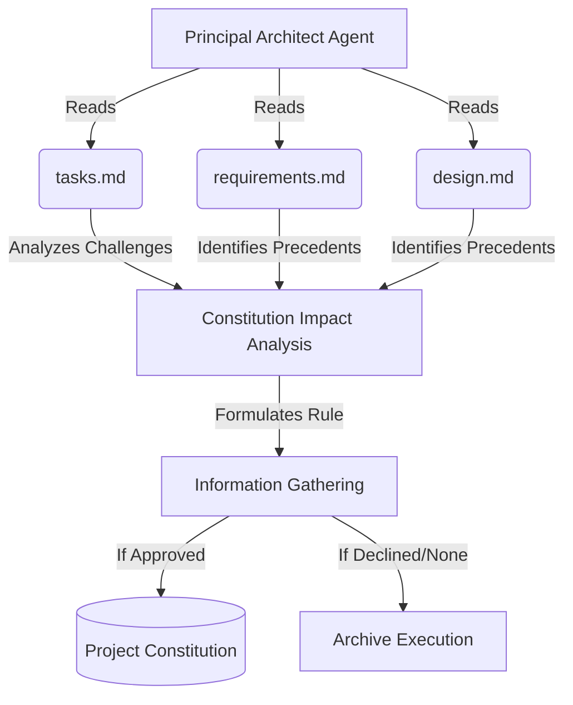

# Technical Design: Archive Error Prevention

## 1. Architecture Blueprint
*A visual representation of the updated `spf.archive` flow.*

## 4. File & Component Inventory
*The exact files that the Developer must create or modify. Map the core responsibility.*

**Backend:**
- `src/internal/agent/kit/instructions/archive.md` -> Update markdown instructions to mandate analyzing challenges from `tasks.md`, checking if errors could be prevented by Constitution updates, and explicitly formulating a prompt that includes these challenges.