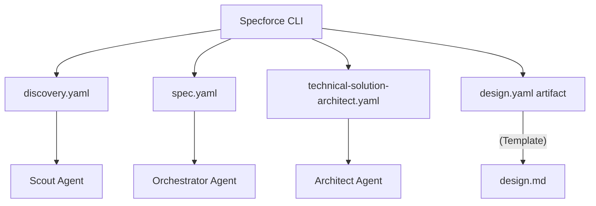

# Technical Design: ASCII Wireframe Instructions for Agent Skills and Artifacts

## 1. Architecture Blueprint



## 2. Persistence & Data Modeling
No database changes.

## 3. API & Interfaces (The Contract)
Updates to YAML instruction and template files to generalize UI wireframing.

## 4. File & Component Inventory

**Agent Kit (Commands & Agents):**
- `src/internal/agent/kit/commands/discovery.yaml`: Generalize "Interface Wireframing" to all UI types.
- `src/internal/agent/kit/commands/spec.yaml`: Generalize verification to any UI layout.
- `src/internal/agent/kit/agents/technical-solution-architect.yaml`: Update "Surface Blueprint" to cover all UI types.

**Artifact Templates:**
- `src/internal/agent/artifacts/spec/design.yaml`: Add universal UI ASCII wireframe mandate to `instruction`.

### Proposed Content Updates:

**`src/internal/agent/artifacts/spec/design.yaml` (Instruction update):**
```markdown
6. **Surface Blueprint (UI-Heavy):** You MUST visualize the core UI surface (Web, TUI, etc.) using ASCII wireframes (Ghost Protocol style: thin borders, 80-char width).
```
