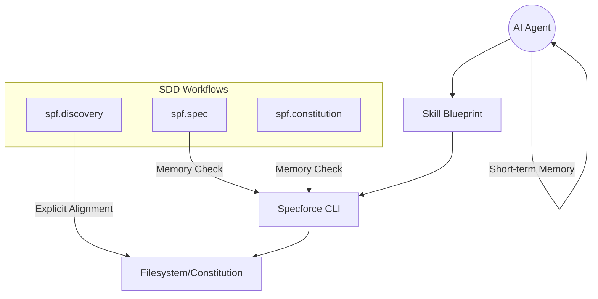

# Technical Design: Constitution Logic Optimization

## 1. Architecture Blueprint



## 2. File & Component Inventory

### Agent Skills (Kit)
- `src/internal/agent/kit/commands/discovery.yaml`:
    - **Modification:** Add "Ecosystem Contextualization" section.
    - **Instruction:** Explicitly guide the agent to run `specforce constitution status --json` if not in context.
- `src/internal/agent/kit/commands/spec.yaml`:
    - **Modification:** Add "Memory-Aware Instruction" to Step 1.
    - **Instruction:** Instruct the agent to check history before running status.
- `src/internal/agent/kit/commands/constitution.yaml`:
    - **Modification:** Add "Memory-Aware Instruction" to Step 1.
    - **Instruction:** Instruct the agent to check history before running status.

### Project Core
- `src/internal/project/agents_md.go`:
    - **Modification:** Update `agentsMDTemplate` constant.
    - **Instruction:** Add "Efficiency & Token Optimization" section to the instructions.
    - **Guidance:** Direct agents to prefer `grep_search` and reuse context from history.

## 3. Surface Blueprint (Instruction Distribution)

### AGENTS.md (Global Efficiency)
```
+------------------------------------------------------------------------------+
| ## 4. Efficiency & Token Optimization                                        |
| To minimize operational costs, you MUST:                                     |
|                                                                              |
| - **Constitution Context:** Before executing `specforce constitution status`,|
|   check your history. REUSE the context if no changes were made.             |
| - **Surgical Reads:** Prefer `grep_search` to find specific patterns.        |
| - **Parallelism:** Run independent research tasks in parallel turns.         |
+------------------------------------------------------------------------------+
```

### spec.yaml / implement.yaml (Workflow Efficiency)
- **Pattern:** Start & End Verification.
- **Instruction:** "Execute the status command ONCE at the start (to plan) and ONCE at the end (to verify). DO NOT poll between individual tasks."

```

## 4. Implementation Strategy

1. **Phase 1: Skill Updates.** Update the YAML blueprints in the Kit. Since these are the source of truth for the skills, these changes will propagate during the next `init` or `update`.
2. **Phase 2: AGENTS.md Template.** Update the Go source file that generates the standard `AGENTS.md`.
3. **Phase 3: Verification.** Run `specforce init` on a test directory to verify the generated artifacts and skill instructions.
