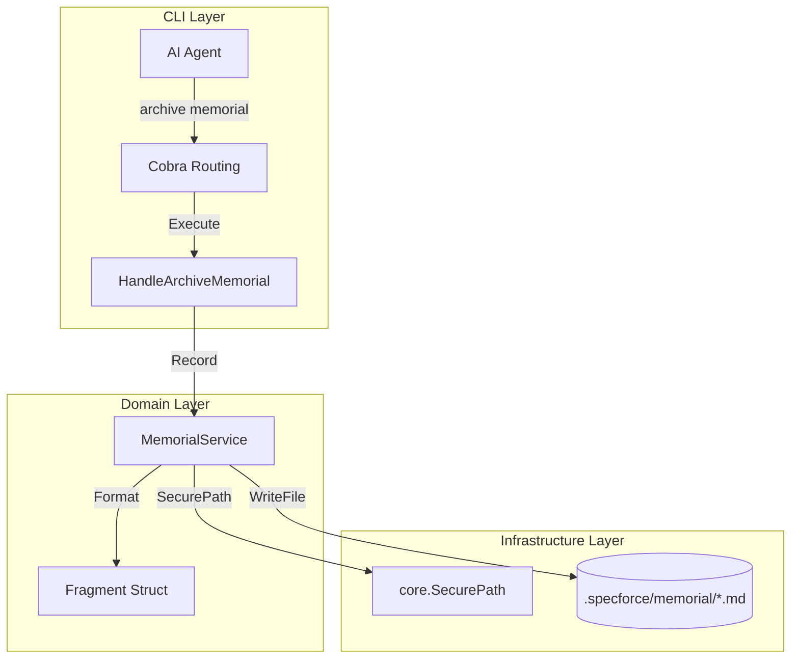

# Technical Design: Optimize Archive Memorial

## 1. Threat Modeling (Security-First)

### Authorization & Access
- **Identity:** Local OS user. The command operates within the project directory.
- **Access Control:** Relies on filesystem permissions (Standard Specforce model: `0750` for directories, `0600` for files).

### Input Validation
- **`<slug>`:** Sanitized via `strings.Map` to allow only `[a-z0-9-]`. Empty slug defaults to sanitized title.
- **`--type`:** Validated against allowed types: `lesson`, `decision`, `context`. Map internal `FragmentType` constants.
- **`--title` / `--content`:** Must be non-empty. Shell-escaped by the CLI framework (Cobra).

### Resilience & Integrity
- **Path Traversal:** Prevented by `core.SecurePath` in the `MemorialService`.
- **Race Conditions:** Low risk (single-user CLI). File creation uses unique timestamps down to the minute.
- **Idempotency:** Repeated calls with the same slug/timestamp will overwrite, but since timestamps include minutes, collision probability is low for legitimate use.

## 2. Data & Persistence

### Memorial Fragment Persistence
Fragments are stored as Markdown files with YAML frontmatter.

- **Location:** `.specforce/memorial/`
- **Naming Convention:** `YYYYMMDD-HHmm-<slug>.md`
- **Permissions:** `0600` (Owner read/write).

**Frontmatter Schema:**
```yaml
date: YYYY-MM-DD
scope: <slug>
author: <agent-id> (e.g., opencode)
type: <FragmentType>
```

**Markdown Body:**
```markdown
# <title>

<content>
```

## 3. API Contracts & Interfaces

### CLI Command Signature
```bash
specforce archive memorial <slug> \
  --type [lesson|decision|context] \
  --title "Brief summary of the lesson" \
  --content "Detailed technical description or decision rationale"
```

### Behavior
- **Exit Code 0:** Successful creation. Outputs the absolute path to the created file.
- **Exit Code 1:** Validation failure or I/O error.

## 4. Visual Architecture



## 5. File Inventory

| Path | Purpose |
|---|---|
| `src/internal/cli/archive.go` | Route and handle the new `memorial` subcommand. |
| `src/internal/agent/kit/instructions/archive.md` | Update "Knowledge Harvesting" step to use the new CLI command. |
| `src/internal/agent/kit/commands/archive.yaml` | (Optional) Refine description to explicitly mention memorial automation. |

## 6. Surface Blueprint (Agent Instruction Update)

### Manual vs. Automated Comparison

**OLD (Manual):**
```markdown
- **Action:** Create a NEW Markdown file in `.specforce/memorial/` with a filename in the format `{{CURRENT_DATETIME}}-{feature-slug}.md`.
- **Content:** The file MUST include YAML frontmatter...
```

**NEW (Automated):**
```markdown
- **Action:** Record your findings using the CLI:
  ```bash
  specforce archive memorial <slug> --type <type> --title "<title>" --content "<content>"
  ```
```

## 7. Observability & Resilience

### Logging & Feedback
- The command MUST print a success message following the "Ghost in the Machine" aesthetic:
  ```text
  ◉ MEMORIAL RECORDED: .specforce/memorial/20260513-1023-optimize-archive-memorial.md
  ```
- Errors MUST be displayed with the `↳` indicator for context.

### Safety Guards
- Verify that the `.specforce/memorial` directory exists (or initialize it via `MemorialService.Initialize`).
- Ensure no directory traversal is possible via the `<slug>`.
