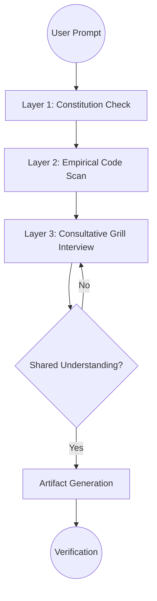

# Technical Design: Multi-Layered Consultative Orchestrator

## 1. Architecture Blueprint

The enhancement is implemented entirely within the Instruction layer of the `spf.spec` command.



## 2. Instruction Logic Flow (Algorithm)

The `src/internal/agent/kit/commands/spec.yaml` will be updated to enforce the following logic in the `Discovery & Intent Clarification` section:

1.  **Constitutional Anchor:** 
    - Read `.specforce/docs/`.
    - Identify documents relevant to the prompt (e.g., if UI is mentioned, read `ui-ux.md`).
    - Store constraints in internal state.
2.  **Empirical Grounding:**
    - Parse the prompt for keywords (e.g., "auth", "cli", "database").
    - Execute `grep_search` to find existing implementations.
    - Read 2-3 most relevant files to extract patterns.
3.  **The "Grill" (Consultative Interview):**
    - State: "Based on our Constitution (citing X) and existing code (citing Y), I recommend Z."
    - Ask: "Does this align with your vision, or should we explore alternative A?"
    - Repeat for every major design decision in the branch.

## 3. File & Component Inventory

**Agent Instructions (Orchestrator):**
- `[src/internal/agent/kit/commands/spec.yaml]` -> Update the `Discovery & Intent Clarification` section to implement the three-layered flow.

## 4. Interaction Wireframe (Consultative Example)

```
+------------------------------------------------------------------------------+
| [SPECFORCE ORCHESTRATOR]                                                     |
+------------------------------------------------------------------------------+
| > Intent: Add OAuth2 support                                                 |
+------------------------------------------------------------------------------+
| [📜 CONSTITUTION] Found Security Rule: "All Auth providers must use OIDC".    |
| [🔍 CODEBASE] Found existing JWT logic in `internal/auth/provider.go`.       |
|                                                                              |
| [💬 THE GRILL] To add OAuth2 while respecting OIDC and our current JWT flow, |
| I recommend extending the `AuthProvider` interface instead of a new service. |
|                                                                              |
| Question 1: Should we use the existing JWT signer for the OAuth token?       |
| Recommendation: Yes, to maintain consistency with internal session management.|
|                                                                              |
| [ ( ) Yes, use existing ]  [ ( ) No, create new ]  [ ( ) Help/Details ]      |
+------------------------------------------------------------------------------+
```
