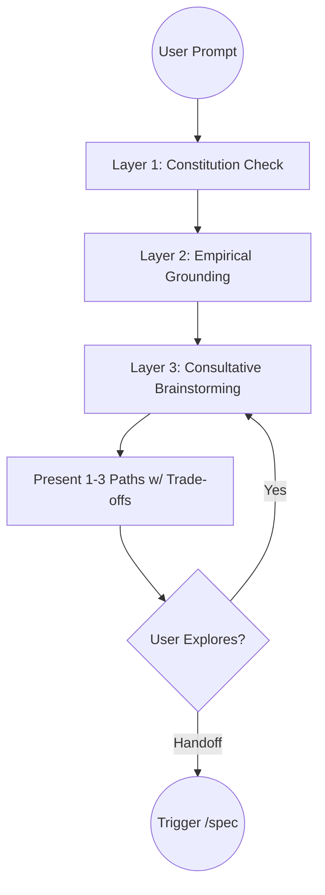

# Technical Design: Consultative Discovery Orchestrator

## 1. Architecture Blueprint
The enhancement is implemented via prompt engineering within the `discovery.yaml` command definition.

## 2. Instruction Logic Flow (Algorithm)
The `src/internal/agent/kit/commands/discovery.yaml` will be updated to enforce the `Consultative Exploration Funnel`:

1. **Layer 1 (Constitution):** Instruct the agent to read `.specforce/docs/` files relevant to the topic.
2. **Layer 2 (Codebase):** Instruct the agent to use `grep_search` and `read_file` to find current implementations of similar logic.
3. **Layer 3 (Brainstorming):** Instruct the agent to act as a thought partner, generating 1-3 potential paths based on the constraints discovered in Layers 1 and 2. It must present the trade-offs and end with an open-ended question (e.g., "Which path aligns best with your vision?").

## 4. File & Component Inventory

**Agent Instructions (Commands):**
- `[src/internal/agent/kit/commands/discovery.yaml]` -> Rewrite the core logic and workflow sections to enforce the 3-layer consultative funnel.