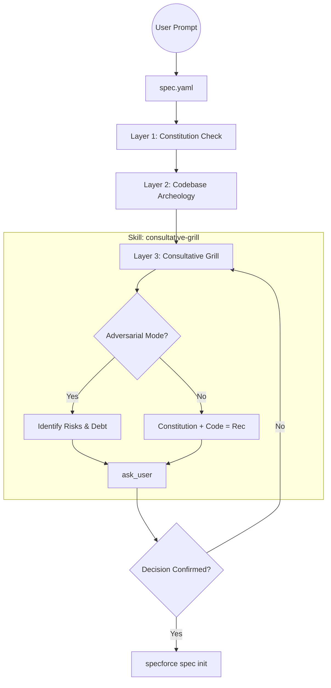

# Technical Design: Consultative Grill Reinforcement

## 1. Architecture Blueprint

The enhancement integrates the renamed `consultative-grill` skill into the core SDD orchestration flow, establishing it as the mandatory decision-making gate.



## 2. File & Component Inventory

**Skills:**
- `[src/internal/agent/kit/skills/consultative-grill/SKILL.yaml]` -> Renamed from `spec-clarification-interview`. Updated with the "Grill" logic, triad recommendation pattern, and "Modo Adversário" instructions.

**Commands (Orchestrator):**
- `[src/internal/agent/kit/commands/spec.yaml]` -> Update Step 1.C to explicitly name the skill and mandate its activation for core architectural/design branches. Add specific logic to detect "Grill Me" intent.

**Agents:**
- `[src/internal/agent/kit/agents/product-analyst.yaml]` -> Update skill reference from `spec-clarification-interview` to `consultative-grill`.
- `[src/internal/agent/kit/agents/technical-solution-architect.yaml]` -> Add `consultative-grill` to the `skills` list to allow the Architect to challenge its own designs.
- `[src/internal/agent/kit/agents/technical-developer.yaml]` -> Add `consultative-grill` to the `skills` list to allow the Developer to grill the user on implementation tradeoffs.

## 3. Interaction Design (Consultative Pattern)

The `consultative-grill` skill will enforce the following output pattern for decisions:

```markdown
### [🔥 CONSULTATIVE GRILL] Decision: {Topic}

- **[📜 CONSTITUTION]:** {Citation from .specforce/docs/}
- **[🔍 CODEBASE]:** {Pattern found in src/...}
- **[💡 RECOMMENDATION]:** {The agent's proposed path}

**Question:** {Specific binary question to confirm or pivot}
```

If "Grill Me" (Adversarial) intent is detected:
```markdown
### [💀 ADVERSARIAL GRILL] Stress Test: {Topic}

- **[⚠️ RISK]:** {Identify a technical gap or potential debt}
- **[🛡️ DEFENSE]:** {Ask the user to justify the design against this risk}
```
