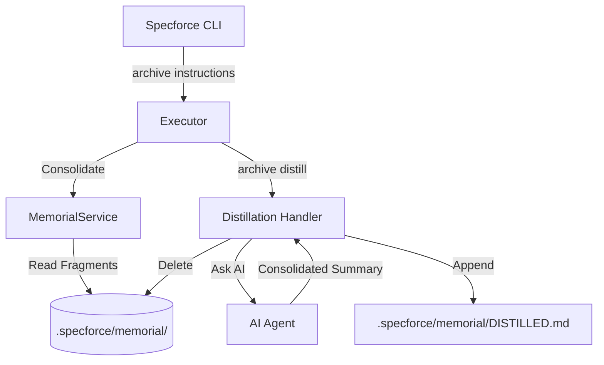

# Technical Design: Memorial Distillation and Efficiency

## 1. Architecture Blueprint
*Workflow for Memorial Playback and Distillation.*



## 2. API & Interfaces (The Contract)

### CLI Commands
- **Command:** `specforce archive distill --slug <slug1>,<slug2> --summary "<content>"`
- **AuthZ:** Developer/Agent access.
- **Action:** Appends the `<content>` to `DISTILLED.md` and deletes the fragments matching the slugs.

### Service Interfaces
- **File:** `src/internal/project/memorial.go`
- **Method:** `Distill(ctx context.Context, slugs []string, summary string) error`
- **Responsibility:** Atomic write to `DISTILLED.md` and deletion of individual fragment files.

## 3. File & Component Inventory

**Backend:**
- `src/internal/project/memorial.go` -> Implement `Distill` method in `MemorialService`.
- `src/internal/cli/archive.go` -> Update `HandleArchiveInstructions` to use `Consolidate` content instead of filenames.
- `src/internal/cli/archive.go` -> Implement `HandleArchiveDistill` and route the new subcommand.
- `src/internal/cli/cobra/archive.go` -> Define the `distill` command and flags (`--slug`, `--summary`).
- `src/internal/cli/cli.go` -> Update `HandleInit` (or `handleNewInitFlow`) to remove `.specforce/docs/memorial.md` if it exists.

**Instructions:**
- `src/internal/agent/kit/instructions/archive.md` -> Add "Step 9: Memory Distillation" to the protocol.
- `src/internal/agent/kit/commands/archive.yaml` -> Add `distill` to the agent's available actions.

## 4. Distillation Summary Schema
The `DISTILLED.md` file will follow this structure:
```markdown
# Consolidated Memorial (Distilled)

## [YYYY-MM-DD] Distillation: [List of Slugs]
**Author:** [Author]
**Summary:** [The AI generated summary]

---
```
