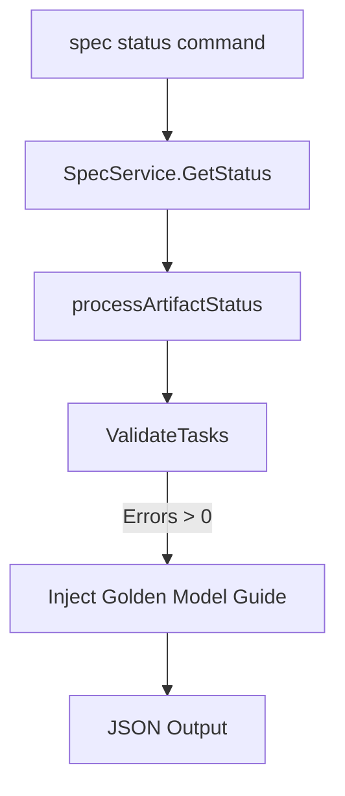

# Technical Design: Validation Guide Golden Model

## 1. Architecture Blueprint
*A visual representation of the data flow or entity relationships for this feature.*

## 4. File & Component Inventory
*The exact files that the Developer must create or modify. Map the core responsibility.*

**Backend:**
- `[src/internal/spec/status.go]` -> Modify `ArtifactStatus` struct to add `ValidationGuide string json:"validation_guide,omitempty"`. Update `processArtifactStatus` to populate this field when `ValidateTasks` returns errors for `tasks.md`.