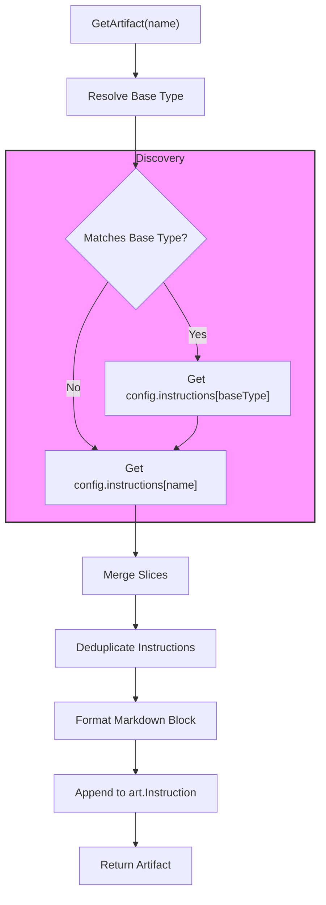

# Technical Design: Layered Instruction Mapping

## 1. Architecture Blueprint

The instruction injection logic follows a layered approach where generic base-type rules are merged with artifact-specific rules.



## 2. Technical Decisions

### 2.1. Base Type Inference (Heuristic)
To identify the generic category of an artifact (e.g., `feature-requirements` -> `requirements`), the system will use a **Right-to-Left Keyword Match**.

- **Base Types:** `requirements`, `design`, `tasks`, `implementation`, `archive`.
- **Logic:** The system searches for the occurrence of any base type within the requested name. If multiple base types are found, the one with the **highest starting index** (furthest to the right) is selected.
- **Example:** `tasks-for-design` will match `design` because "design" starts at index 10, while "tasks" starts at index 0.

### 2.2. Merging & Deduplication
Instructions are merged in a deterministic order:
1. **Generic Instructions** (from inferred base type).
2. **Specific Instructions** (from exact artifact name).

The resulting list is deduplicated using a map-based approach while preserving the order of the first occurrence.

### 2.3. Markdown Formatting
The instructions will be appended to the artifact's `Instruction` field using the following template:

```markdown

## Project Specific Instructions
- Instruction 1
- Instruction 2
```

If the exact name matches the base type (e.g., requesting `requirements` when `requirements` is the base type), the system will avoid duplicate fetching to prevent redundancy before deduplication.

## 4. File & Component Inventory

**Backend:**
- `[src/internal/spec/service.go]`
    - **Modify `GetArtifact`**: Refactor to use the new layered resolution logic.
    - **Add `inferBaseType(name string) string`**: Implement the right-to-left keyword matching heuristic.
    - **Add `resolveInstructions(conf *core.ProjectConfig, name string) []string`**: Orchestrate gathering, merging, and deduplication.
- `[src/internal/core/config.go]`
    - **Update `DefaultConfigContent`**: Enhance documentation comments in the YAML template to explain layered mapping (generic vs. prefixed keys).

## 5. Observability & Resilience
- **Graceful Degradation:** If `config.yaml` is missing or the `instructions` map is empty, `GetArtifact` continues without modification.
- **Logging:** When debug logging is active, the system will log the inferred base type and the number of instructions merged.
