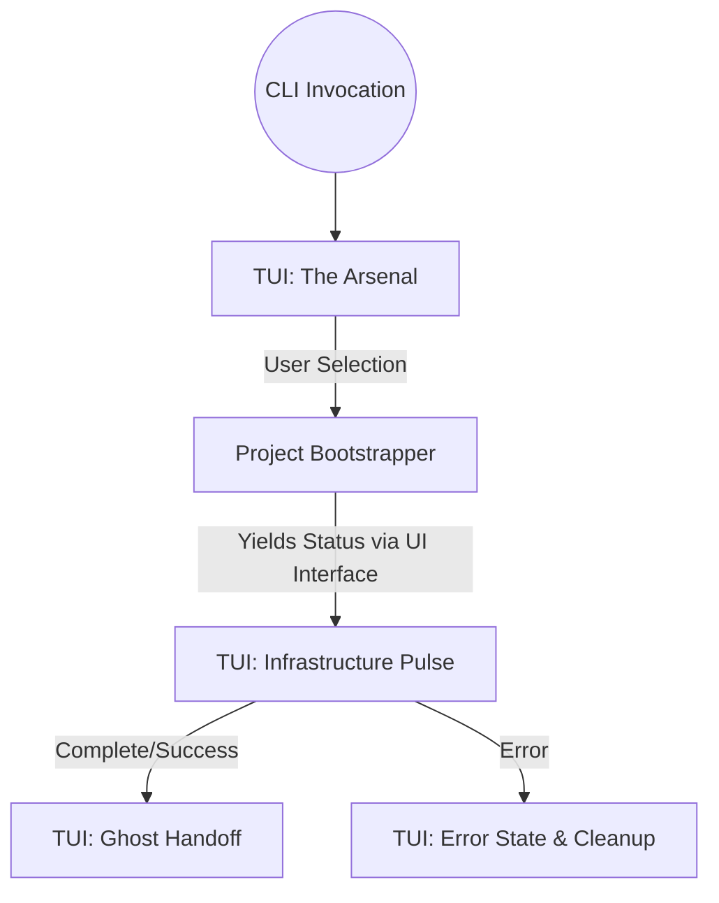

# Technical Design: Init Layout Refinement

## 1. Architecture Blueprint
*The execution flow for the `specforce init` command, mapping the transition between the three core UI phases.*



## 2. Surface Blueprint (UI-Heavy)
*Visual layout for the core TUI components adhering to the Ghost Protocol.*

### State 1: The Arsenal (Agent Selection)
```text
+---------------------------------------------------------+
| SELECT AI AGENTS                                        |
+---------------------------------------------------------+
|                                                         |
|  › ◉ Gemini ............................... [ ACTIVE ] |
|    ○ Claude ............................... [ READY  ] |
|    ○ GPT-4 ................................ [ READY  ] |
|                                                         |
+---------------------------------------------------------+
| space: toggle • y: confirm • q: abort    (v1.0.4-ghost) |
+---------------------------------------------------------+
```

### State 2: Infrastructure Pulse (Bootstrap Feedback)
```text
 › DEPLOYING INFRASTRUCTURE...
   ↳ .specforce/docs ................................. OK
   ↳ .specforce/specs ................................ OK
   ↳ .specforce/memorial ............................. OK
 › SYNCING AGENT ARTIFACTS...
   ↳ Gemini configuration deployed.
```

### State 3: The Ghost Handoff (Completion)
```text
+---------------------------------------------------------+
| MISSION ACCOMPLISHED                                    |
|                                                         |
| Specforce structure is live.                            |
|                                                         |
| NEXT: Run '/spf:discovery' to start the SDD cycle.      |
+---------------------------------------------------------+
```

## 3. File & Component Inventory
*The exact files that the Developer must create or modify.*

**Core Logic:**
- `src/internal/project/bootstrapper.go` -> Modify `BootstrapProject` to emit granular log events (e.g., `ui.LogSubTask`) instead of a single spinner, supporting the "Pulse" view.
- `src/internal/project/service.go` -> Update `InitializeProject` to align its output with the "Pulse" layout (removing redundant `ui.SubTask` and `ui.StartSpinner` calls if necessary).
- `src/internal/cli/cli.go` -> Update `handleNewInitFlow` to render the final "Ghost Handoff" box layout using a refined `tui.PrintCompletionBox` call.

**TUI Components:**
- `src/internal/tui/multiselect.go` -> Refactor `viewSelection()` to wrap the list in a `CleanBorder` frame and format the item rows to align the status labels (e.g., `[ ACTIVE ]`).
- `src/internal/tui/theme.go` -> Ensure `CleanBorder` and necessary color aliases (e.g., `successGreen`, `warningYellow`, `brandCyan`) are exported and used across the new components.
- `src/internal/tui/components.go` -> Refine `PrintCompletionBox` to use `CleanBorder` and align with the "Ghost Handoff" layout. Update `LogSubTask` to support the `↳ ... OK` formatting if needed.