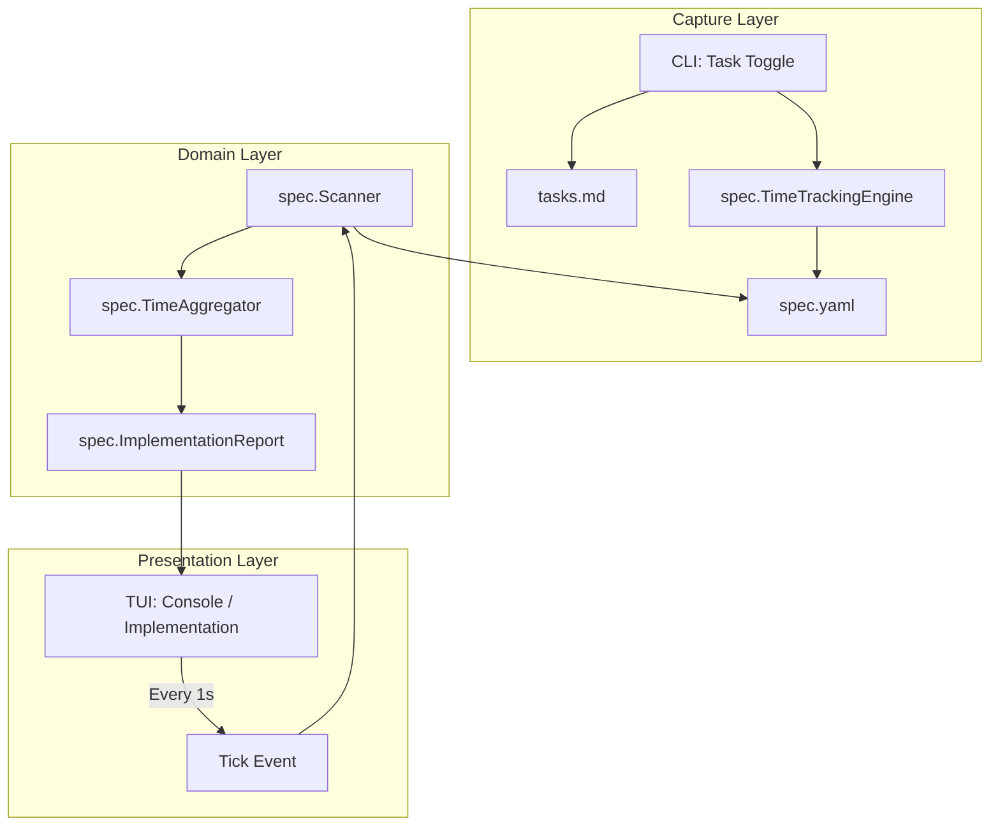
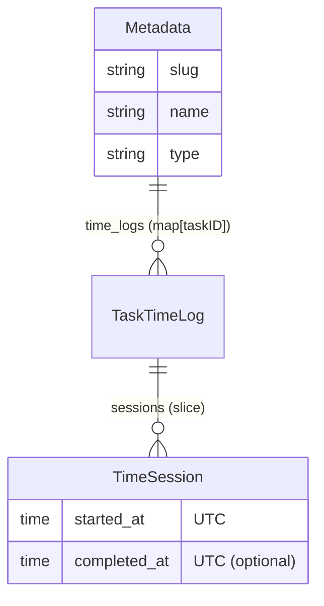

# Technical Design: Task Time Tracking

## 1. Architecture Blueprint



## 2. Persistence & Data Modeling

### spec.yaml Schema Extension
The `Metadata` struct in `src/internal/spec/metadata.go` is expanded to include a map of task logs.



### Struct Definitions (`src/internal/spec/metadata.go`)
```go
type TimeSession struct {
    StartedAt   time.Time  `json:"started_at" yaml:"started_at"`
    CompletedAt *time.Time `json:"completed_at,omitempty" yaml:"completed_at,omitempty"`
}

type TaskTimeLog struct {
    Sessions []TimeSession `json:"sessions" yaml:"sessions"`
}

// Metadata update
type Metadata struct {
    Slug     string                 `json:"slug" yaml:"slug"`
    Name     string                 `json:"name" yaml:"name"`
    Type     string                 `json:"type" yaml:"type"`
    TimeLogs map[string]TaskTimeLog `json:"time_logs,omitempty" yaml:"time_logs,omitempty"`
}
```

## 3. Component Logic & Interfaces

### Session Management (`src/internal/spec/metadata.go`)
- `func (m *Metadata) StartSession(taskID string)`: Appends a new session with `StartedAt = time.Now().UTC()`. Ensures previous sessions for the task are closed.
- `func (m *Metadata) EndSession(taskID string)`: Finds the active session (`CompletedAt == nil`) and sets it to `time.Now().UTC()`.
- `func (m *Metadata) GetTaskDuration(taskID string) time.Duration`: Calculates cumulative duration for a task.

### Trigger Integration (`src/internal/spec/tasks.go`)
Modify `updateTaskStatusFile` to perform side-effect logging:
1. Load `spec.yaml`.
2. If `newStatus == "in-progress"`, call `meta.StartSession(taskID)`.
3. If `newStatus == "finished"` or `newStatus == "todo"`, call `meta.EndSession(taskID)`.
4. Call `SaveMetadata`.

### Aggregate Logic (`src/internal/spec/implementation.go`)
Update `ImplementationTask` and `ImplementationReport`:
- `ImplementationTask.TotalTime`: `time.Duration`
- `ImplementationTask.IsWorking`: `bool`
- `ImplementationReport.TotalTime`: `time.Duration`

`ParseTasks` will load metadata and populate these fields by cross-referencing `taskID`.

## 4. File & Component Inventory

**Backend:**
- `src/internal/spec/metadata.go` -> Define `TimeSession`, `TaskTimeLog` and session management methods.
- `src/internal/spec/tasks.go` -> Integrate `StartSession`/`EndSession` into `updateTaskStatusFile`.
- `src/internal/spec/implementation.go` -> Update report structures and `ParseTasks` to include time data.
- `src/internal/spec/scanner.go` -> Update `StateItem` to include `TotalTime` and `ActiveTaskElapsed`.

**Frontend:**
- `src/internal/tui/theme.go` -> Add `ClockStyle` (Mint) and `OvertimeStyle` (Yellow).
- `src/internal/tui/implementation.go` -> Update `renderTask` to display duration and "working" status.
- `src/internal/tui/console.go` -> Update `renderItem` (CategoryImplementations) to show aggregate spec time.

## 5. UI Surface (Ghost Protocol Wireframes)

### Implementation Status (Detailed View)
```text
+------------------------------------------------------------------------------+
| IMPLEMENTATION READINESS: 20260522-0027-TASK-TIME-TRACKING                   |
| [ READY ]                                                                    |
|                                                                              |
| ATOMIC TASKS                                                                 |
|                                                                              |
|   PHASE 1: DATA ARCHITECTURE                                                 |
|     ◉ T1.1: Update Metadata struct and YAML tags                             |
|         Target: src/internal/spec/metadata.go                                |
|         Time: 45m                                                            |
|     ◉ T1.2: Implement session management logic                               |
|         Target: src/internal/spec/metadata.go                                |
|         Time: 1h 15m (IN-PROGRESS) ⏲                                         |
|     ○ T1.3: Update tasks.md trigger                                          |
|         Target: src/internal/spec/tasks.go                                   |
|                                                                              |
| esc: back • q: quit                                          TOTAL: 2h 00m   |
+------------------------------------------------------------------------------+
```

### Specforce Console (High-Density Dashboard)
```text
+------------------------------------------------------------------------------+
| [SPECFORCE CONSOLE]                                                          |
|                                                                              |
| 🚀 ACTIVE IMPLEMENTATIONS (Execution Phase)                                  |
|   ◉ 20260522-0027-task-time-tracking [wt:main] - [██████░░░░] (2/5 tasks)    |
|     ↳ Working on: T1.2 Implement session management (1h 15m elapsed)         |
|                                                                              |
| 📋 ACTIVE SPECIFICATIONS (Planning Phase)                                    |
|   ○ 20260523-0900-next-cool-feature - [░░░░░░░░░░] (0/3 artifacts)           |
|                                                                              |
| esc: quit • r: refresh                                        UPTIME: 14m    |
+------------------------------------------------------------------------------+
```

## 6. Observability & Resilience
- **Timezone Drift:** All internal calculations use `time.Now().UTC()`. TUI renders using local time but strictly for display relative to the current moment.
- **Concurrent Access:** `SaveMetadata` uses `0600` permissions. File locking (via `flock` or similar if needed) is deferred unless multi-process collision is detected (currently CLI is single-process).
- **Auditability:** Every session start/stop is a discrete YAML entry, allowing for manual recovery or audit if `spec.yaml` is inspected.
