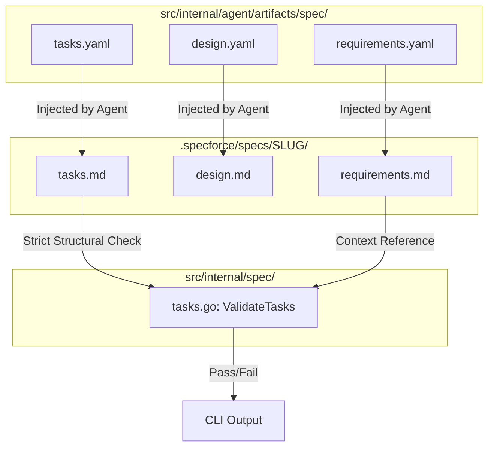

# Technical Design: Spec Hardening & Self-Containment

## 1. Architecture Blueprint



## 2. File & Component Inventory
**Backend:**
- `[src/internal/agent/artifacts/spec/requirements.yaml]` -> Hardening instructions for mandatory `[US-x]` edge cases, localized NFRs (enforcing the `**[Performance]**` tag), and conditional lens-based section removal.
- `[src/internal/agent/artifacts/spec/design.yaml]` -> Hardening instructions for deterministic Mermaid diagrams, ASCII wireframes for UI lenses, and explicit "Zero Philosophy" mandates to prevent architectural fluff.
- `[src/internal/agent/artifacts/spec/tasks.yaml]` -> Hardening instructions for technical directives, mandatory `**Context:**` linking, and a requirement for high-density action steps (minimum 3 per task).
- `[src/internal/spec/tasks.go]` -> Enhancing `ValidateTasks` to enforce granular quality checks by counting action items per task and strictly validating Phase/Task sequence integrity.

## 3. Structural Hardening Details

### 3.1 Template Instruction Hardening
The `instruction` blocks in the embedded YAML artifacts will be updated to act as strict "system prompts" for the artifact generation phase:

- **Requirements Hardening:**
    - Mandatory localized `Technical Constraints (NFR)` block for every `[US-x]`.
    - Mandatory `**[Performance]:**` tag within every localized NFR block.
    - Forced deletion of UI/UX sections for `Backend-heavy` lenses.
- **Design Hardening:**
    - Strict prohibition of `TBD` or placeholders.
    - Mandatory `File & Component Inventory` with absolute-style project paths.
- **Tasks Hardening:**
    - Mandatory `Action Steps` density (must describe *how* the implementation changes the code).
    - Mandatory `Verification (TDD)` command or scenario for every task.

### 3.2 Logic-Based Validation (`tasks.go`)
The `ValidateTasks` function will be upgraded to perform content-aware validation beyond simple regex matching:

| Check | Severity | Logic |
|-------|----------|-------|
| **Action Density** | Error | `count(ActionSteps) < 2` |
| **Action Quality** | Warning | `count(ActionSteps) < 3` |
| **Phase Sequence** | Error | `CurrentPhaseID != PreviousPhaseID + 1` |
| **Task Sequence** | Error | `CurrentTaskID != PreviousTaskID + 1` (within Phase) |
| **Field Presence** | Error | Missing `**Target:**`, `**Context:**`, or `**Acceptance Check:**` |

#### Data Structure Changes:
```go
type taskBlock struct {
    id                string
    line              int
    hasTarget         bool
    hasContext        bool
    hasActionHeader   bool
    hasActionItems    bool
    hasVerify         bool
    inActionSteps     bool
    actionItemsCount  int // New counter for density check
}
```

## 4. Observability & Resilience
- **Error Correlation:** Validation errors in `tasks.go` must include the line number and the specific Task ID (e.g., `T1.2`) to allow the agent to perform surgical corrections.
- **Atomic Rollback:** If the hardening of templates causes existing parsers to fail (detected during CI), the changes must be reverted to maintain backward compatibility for `spec status` commands.
