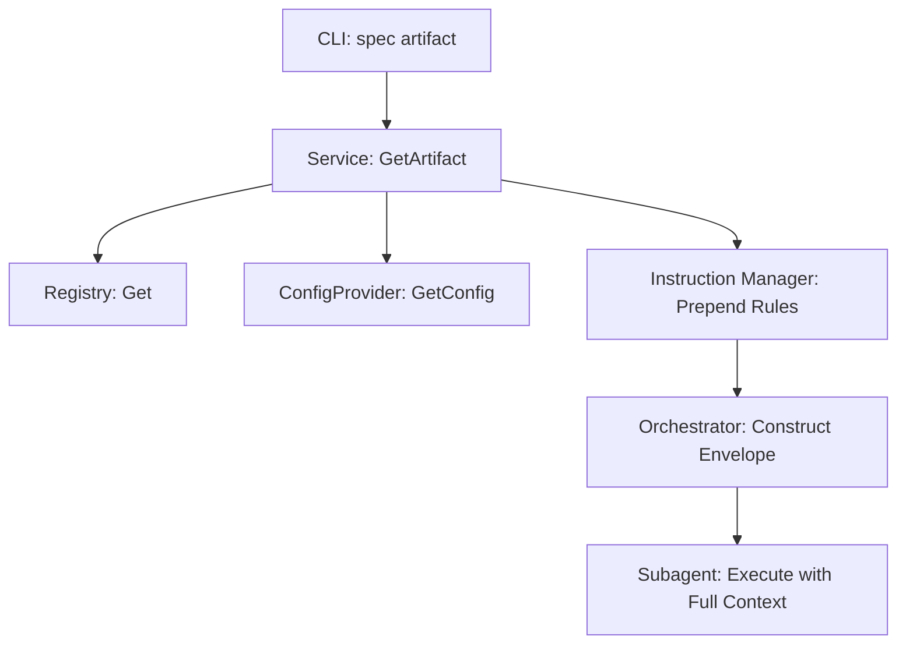

# Technical Design: Spec Generation Optimization

This design specifies the implementation of a deterministic, dependency-aware generation pipeline and optimized instruction visibility for AI agents. It prioritizes project-specific rules by prepending them to prompts and ensures artifact generation follows a logical topological order.

## 1. Architecture Blueprint
The following diagram represents the refined flow of artifact retrieval and instruction injection, ensuring that project-specific constraints and shared context are processed before base instructions.



## 2. Subagent Context Envelope (The Mission Brief)
To prevent context loss during delegation, the orchestrator MUST construct a structured prompt that includes rules, shared understanding, mandated skills, and instructions.

### 2.1 Mission Brief Template (Text-Only)
```markdown
# MISSION BRIEF: {name}
Description: {description}

## 1. MANDATED SKILLS (USE THESE SKILLS)
- {primary_skill_name}: {skill_purpose}
- {supporting_skill_name} (if applicable)

## 2. PROJECT RULES (MAXIMUM PRIORITY)
- {rule1}
- {rule2}

## 3. SHARED CONTEXT (FEATURE SPECIFICS)
- DESIGN DECISIONS: {summary_of_grill_decisions}
- CODEBASE INSIGHTS: {relevant_files_and_symbols}
- DEPENDENCY DATA: {full_content_of_upstream_artifact}

---
## 4. BASE INSTRUCTIONS
{instruction}
```

### 2.2 Artifact-to-Skill Mapping
The orchestrator MUST use the following mapping for dynamic discovery:

| Artifact | Primary Skill | Supporting Skill |
| :--- | :--- | :--- |
| requirements | pragmatic-product-owner | spec-clarification-interview |
| design | technical-solution-architect | premium-frontend-design (if UI) |
| tasks | task-atomic-decomposition | tdd |
| constitution | spf.constitution | consultative-grill |


## 4. File & Component Inventory

| Component | File Path | Responsibility |
| :--- | :--- | :--- |
| **Registry** | `src/internal/spec/registry.go` | Implement `topologicalSort` and update `List()`/`ListForType()` to respect the sorted order. |
| **Service** | `src/internal/spec/service.go` | Update `GetArtifact` to prepend instructions and ensure `resolveInstructions` follows the new prominence rule. |
| **Instruction Manager** | `src/internal/agent/instructions.go` | Refactor `GetInstructions` to support prepending custom rules. |
| **Orchestrator Skill** | `src/internal/agent/kit/commands/spec.yaml` | Update `spf.spec` pipeline to construct and prepend the "Mission Brief" to subagent calls. |
| **TDD Skill** | `src/internal/agent/kit/skills/task-atomic-decomposition/SKILL.yaml` | Harden TDD mandates in the artifact guidance section. |

## 5. Observability & Resilience
- **Error Propagation:** `NewRegistry` will fail-fast if a circular dependency exists in the embedded `spec.yaml` files.
- **Validation:** `spec status` will display artifacts in the order they should be generated, providing a natural roadmap for the developer.
- **Tests:** Add unit tests for `TopologicalSort` with various dependency depths and cycles.
