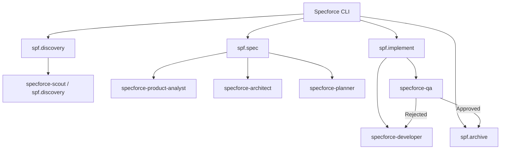

# Technical Design: Standardize Agents Naming and Prompts

## 1. Architecture Blueprint
The following diagram illustrates the corrected orchestration flow between the Specforce CLI commands and the renamed specialists.



## 2. File & Component Inventory

### Agents (Renaming & Prompt Update)
- `[src/internal/agent/kit/agents/product-analyst.yaml]` -> `[src/internal/agent/kit/agents/specforce-product-analyst.yaml]`
  - Responsibility: Update `name` to `specforce-product-analyst`, add "No Code" and "Non-recursive" rules.
- `[src/internal/agent/kit/agents/technical-solution-architect.yaml]` -> `[src/internal/agent/kit/agents/specforce-architect.yaml]`
  - Responsibility: Update `name` to `specforce-architect`, add "Non-recursive" rules.
- `[src/internal/agent/kit/agents/technical-project-planner.yaml]` -> `[src/internal/agent/kit/agents/specforce-planner.yaml]`
  - Responsibility: Update `name` to `specforce-planner`, add "No Code" and "Non-recursive" rules.
- `[src/internal/agent/kit/agents/technical-developer.yaml]` -> `[src/internal/agent/kit/agents/specforce-developer.yaml]`
  - Responsibility: Update `name` to `specforce-developer`, add "Non-recursive" and "Self-Healing" rules.
- `[src/internal/agent/kit/agents/technical-qa-engineer.yaml]` -> `[src/internal/agent/kit/agents/specforce-qa.yaml]`
  - Responsibility: Update `name` to `specforce-qa`, add "Non-recursive" and correct handoff rules.

### Commands (Orchestration Update)
- `[src/internal/agent/kit/commands/spec.yaml]`
  - Responsibility: Update all agent delegation names to use the `specforce-` prefix. **CRITICAL:** Change `tasks` delegation from `technical-developer` to `specforce-planner`.
- `[src/internal/agent/kit/commands/implement.yaml]`
  - Responsibility: Update agent name references to use the `specforce-` prefix.
- `[src/internal/agent/kit/commands/discovery.yaml]`
  - Responsibility: Update name to `spf.discovery` (if not already) and internal references.
- `[src/internal/agent/kit/commands/constitution.yaml]`
  - Responsibility: Update internal references to the new agent names.

## 4. Prompt Hardening Instructions (Standard Header)
Every agent prompt MUST start with or include the following non-recursive safety block:

```markdown
## Environment Awareness & Safety
- **Non-Recursive Mandate:** You are operating in a multi-agent environment. If your current environment does NOT support spawning sub-agents (e.g., restricted CLI mode), you MUST NOT attempt to use `invoke_agent` or similar delegation tools. Perform all tasks directly within your own context.
- **No Hallucination:** If a tool or agent you intend to call is not listed in your available tools, do not assume its existence. Ask the user for clarification.
```
