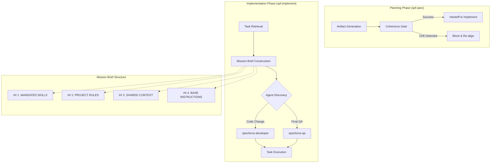

# 1. Technical Design: Reinforce Agent Orchestration

## 2. Visual Architecture
The following diagram illustrates the flow of the Standardized Mission Brief and the Coherence Gate within the Specforce SDD pipeline.



## 3. Data & Persistence
This feature modifies the internal prompt templates (YAML) used by the Specforce orchestration engine. No database schema changes are required as the state is persisted via the existing `spec.yaml` and `tasks.md` files managed by the CLI.

### Prompt State Synchronization
The "Shared Context" in the Mission Brief MUST be synthesized from:
1.  **Design Decisions:** Parsed from the session memory (Consultative Grill).
2.  **Codebase Insights:** File paths and symbols identified during discovery.
3.  **Dependency Data:** Full content of the upstream artifact (e.g., `requirements.md` when building `design.md`).

## 4. API Contracts (Internal Prompts)
The "Contract" in this context refers to the structured Mission Brief envelope that MUST be generated by the orchestrator.

### Standardized Mission Brief Envelope
**Method:** Internal Prompt Injection
**Format:** Markdown
**Structure:**
```markdown
# MISSION BRIEF: {Task_Title}
Description: {Task_Description}

## 1. MANDATED SKILLS (USE THESE SKILLS)
- {Primary_Skill}: {Purpose}
- {Supporting_Skill}: {Purpose}

## 2. PROJECT RULES (MAXIMUM PRIORITY)
- Rule 1: {Rule_Description}
- Rule 2: {Rule_Description}

## 3. SHARED CONTEXT (FEATURE SPECIFICS)
- DESIGN DECISIONS: {Context_Summary}
- CODEBASE INSIGHTS: {Relevant_Symbols}
- DEPENDENCY DATA: {Upstream_Content}

---
## 4. BASE INSTRUCTIONS
{Atomic_Instruction_Set}
```

## 5. File & Component Inventory

| File Path | Responsibility | Change Type |
| :--- | :--- | :--- |
| `src/internal/agent/kit/commands/spec.yaml` | Planning Orchestrator prompt template. | **Update**: Add "Coherence Gate" to Verification & Handoff. |
| `src/internal/agent/kit/commands/implement.yaml` | Implementation Orchestrator prompt template. | **Update**: Inject "Mission Brief" envelope logic and role-based delegation. |

### Contextual Anchoring
- **[src/internal/agent/kit/commands/spec.yaml]**: Update the `### 3. Verification & Handoff` section to include a strict "Coherence Gate" check.
- **[src/internal/agent/kit/commands/implement.yaml]**: Update `### 2. Task Claiming & Context Loading` and `### 3. Task Execution & Verification` to utilize the Mission Brief envelope.

## 6. Observability & Resilience
- **Coherence Failures:** If the Coherence Gate detects drift, it MUST output a specific `[COHERENCE_ERROR]` marker in the agent's output log, detailing which requirement lacks a corresponding task.
- **Persona Verification:** The `implement` orchestrator MUST explicitly log the transition of personas (e.g., `[DELEGATION] -> specforce-developer`) to ensure traceability of execution.
- **Resilience:** If `specforce-developer` or `specforce-qa` are not explicitly registered as available personas, the orchestrator MUST fall back to a generic expert role while still adhering to the Mission Brief rules.

---

## 7. Implementation Roadmap: Coherence Gate Logic
The Coherence Gate in `spec.yaml` will be instructed to perform the following checks:
1.  **Requirement Coverage:** Every Functional Requirement [US-X] in `requirements.md` MUST have at least one corresponding task in `tasks.md` (via `**Context:** [US-X]`).
2.  **Structural Integrity:** `tasks.md` MUST pass CLI validation (checked via `specforce spec status`).
3.  **Consistency:** Technical decisions mentioned in `design.md` (e.g., a specific database index) MUST be reflected in `tasks.md`.

## 8. Implementation Roadmap: Implementation Mission Brief
The Mission Brief in `implement.yaml` will be constructed by:
1.  **Skills:** Auto-detecting if `tdd`, `task-atomic-decomposition`, or `premium-frontend-design` should be activated.
2.  **Priority Rules:** Pulling any `project_rules` found in the `specforce status` JSON.
3.  **Delegation:** Switching the internal persona to `specforce-developer` for implementation and `specforce-qa` for Phase 5 (Final QA).
