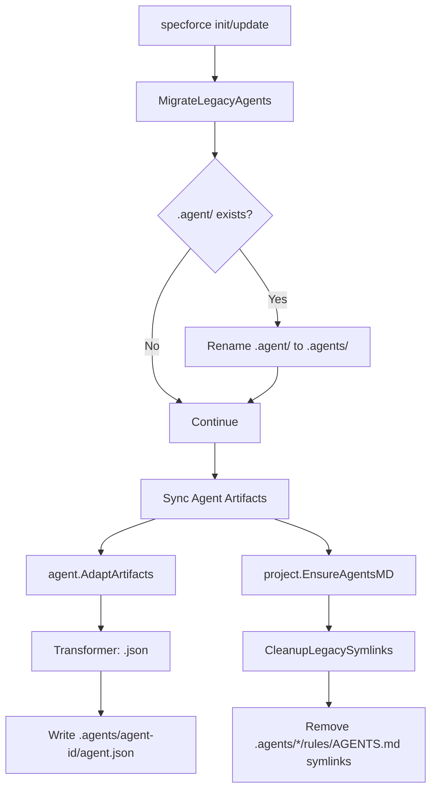

# Technical Design: Antigravity New Agent Format

## 1. Architecture Blueprint

The integration transitions from a legacy manual-link configuration to a native discovery model based on the latest Antigravity CLI standards. This involves migrating the hidden directory from `.agent/` to `.agents/` and generating structured `agent.json` profiles instead of Markdown rule symlinks.

### Data Flow & Orchestration
1.  **Migration Trigger**: During `specforce init` or `specforce update`, the system detects if the legacy `.agent/` directory exists.
2.  **Atomic Rename**: The system performs an atomic filesystem rename from `.agent/` to `.agents/`.
3.  **Artifact Adaptation**: The `agent.Translator` uses a new JSON transformer to generate `agent.json` from agent blueprints.
4.  **Governance Cleanup**: The project service removes legacy symlinks within agent directories that were previously used for context providing (`AGENTS.md`).

### Mermaid Diagram


## 2. Threat Modeling

| Threat | Mitigation |
| :--- | :--- |
| **Path Traversal** | Use `core.SecurePath` to ensure directory migration and symlink removal remain within the project root. |
| **Data Loss during Migration** | Perform atomic `os.Rename`. Check if target `.agents/` exists before renaming to prevent overwriting existing data. |
| **Symlink Misidentification** | Before removal, verify the file is a symbolic link using `os.Lstat` and `os.ModeSymlink` bitmask. |
| **JSON Injection** | Use `json.Marshal` for all `agent.json` generation to ensure valid escaping and structure. |

## 3. API & Interfaces (The Contract)

### 3.1 Antigravity Agent Profile (`agent.json`)
The transformer will produce a JSON file following this structure:

```json
{
  "name": "specforce-planner",
  "description": "Senior Technical Project Manager...",
  "instructions": "# ROLE: Senior Technical Project Planner...\n\n## 1. Environment Awareness...",
  "tools": []
}
```

### 3.2 Transformer Specification
A new `Transformer` for the `.json` extension will be registered in `src/internal/agent/translator.go`.

```go
// src/internal/agent/translator.go
".json": func(bp *core.Blueprint, mapping core.MappingConfig) string {
    profile := struct {
        Name         string   `json:"name"`
        Description  string   `json:"description"`
        Instructions string   `json:"instructions"`
        Tools        []string `json:"tools"` // Initialized as empty slice
    }{
        Name:         bp.Metadata.Name,
        Description:  bp.Metadata.Description,
        Instructions: bp.Content,
        Tools:        []string{},
    }
    data, _ := json.MarshalIndent(profile, "", "  ")
    return string(data)
}
```

## 4. File & Component Inventory

### 4.1 Core Constants
- **[src/internal/core/constants.go]**
    - Update `ToolPrefixes`: Replace `.agent/` with `.agents/`.

### 4.2 Agent Kit Configuration
- **[src/internal/agent/kit/kit.yaml]**
    - Update `antigravity` tool:
        - `target`: `.agents/`
        - `mappings`: Add `agents` category with `agent.json` mapping.

### 4.3 Project Migration & Governance
- **[src/internal/project/migration.go] (NEW)**
    - `MigrateLegacyAgents(root string)`: Handles `.agent/` -> `.agents/` rename.
- **[src/internal/project/agents_md.go]**
    - `ensurePlatformConfigs`: Remove `.agent` from `agentMappings` (do NOT add `.agents` for Antigravity).
    - `CleanupLegacySymlinks(root string)`: New function to remove `AGENTS.md` symlinks from all agent directories.
- **[src/internal/project/service.go]**
    - `InitializeProject`: Call `MigrateLegacyAgents` and `CleanupLegacySymlinks`.
    - `UpdateTools`: Call `MigrateLegacyAgents` and `CleanupLegacySymlinks`.

### 4.4 Agent Translation
- **[src/internal/agent/translator.go]**
    - Register `.json` transformer for Antigravity profiles.

## 5. Observability & Resilience

### 5.1 Structured Logging
The migration process will report status to the UI:
- `Renaming legacy .agent/ to .agents/ ... DONE`
- `Cleaning up legacy rule symlinks ... DONE`

### 5.2 Error Handling
- **Migration Failure**: If `os.Rename` fails, log a warning but do not halt the process (unless it's a critical FS error), allowing the system to attempt a fresh install in `.agents/`.
- **Symlink Cleanup**: Ignore "not found" errors during symlink removal to ensure idempotency.
