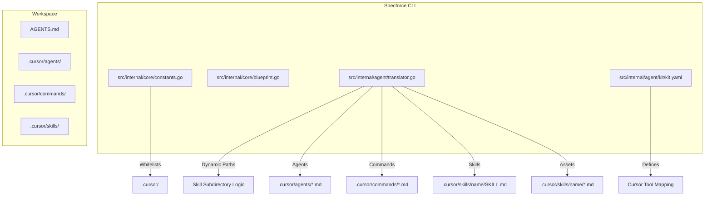

# Design: Cursor Tool Support

## 1. System Overview
The Cursor tool support enables native integration with the Cursor AI code editor by transforming Specforce kit artifacts into standard `.md` files organized in a structured `.cursor/` directory. This integration allows Cursor to discover and apply SDD protocols through its standard context-loading mechanisms.

### 1.1 Visual Architecture


## 2. API Contracts & Data Models

### 2.1 Dynamic Path Resolution
To satisfy **[US-3]**, the mapping system must be able to resolve dynamic paths based on the artifact's metadata (e.g., skill name). The `MappingConfig` and `resolveMappings` logic will be updated to support placeholders or automatic subdirectory creation for skills.

**[src/internal/core/blueprint.go] -> MappingConfig**
```go
type MappingConfig struct {
	Target string `yaml:"target,omitempty"`
	Path   string `yaml:"path"`
	Name   string `yaml:"name"`
	Ext    string `yaml:"ext"`
	// UseSubdir indicates if the artifact name should be used as a subdirectory
	UseSubdir bool `yaml:"use_subdir,omitempty"`
}
```

### 2.2 Standard Transformer
Cursor integration uses the standard Markdown transformer without additional frontmatter (MDC). This ensures maximum compatibility and simplicity.

## 3. Component Mapping & File Inventory

### 3.1 Core Whitelisting
**[src/internal/core/constants.go] -> ToolPrefixes**
- Append `".cursor/"` to the slice to allow the installer to manage the directory.

### 3.2 Kit Configuration
**[src/internal/agent/kit/kit.yaml] -> tools.cursor**
```yaml
  cursor:
    name: "Cursor"
    description: "Cursor AI Code Editor native rules."
    target: ".cursor/"
    mappings:
      agents:
        - path: "agents"
          name: "spf-*"
          ext: ".md"
      commands:
        - path: "commands"
          name: "spf-*"
          ext: ".md"
        - path: "skills"
          name: "SKILL"
          ext: ".md"
          use_subdir: true
      skills:
        - path: "skills"
          name: "SKILL"
          ext: ".md"
          use_subdir: true
```

### 3.3 Translator Logic Refinement
**[src/internal/agent/translator.go] -> resolveMappings**
```go
// If use_subdir is true, prefix the destination path with the artifact name (for skills)
if mapping.UseSubdir {
    artifactDirName := bp.Metadata.Slug // Or sanitized name
    finalPath = filepath.Join(mapping.Path, artifactDirName, finalName)
}
```

## 4. Inventory of Changes

| Path | Responsibility | Change Type |
| :--- | :--- | :--- |
| `src/internal/core/constants.go` | Tool registration | Addition |
| `src/internal/core/blueprint.go` | Data model (MappingConfig) | Extension |
| `src/internal/agent/translator.go` | Dynamic path resolution | Implementation |
| `src/internal/agent/kit/kit.yaml` | Tool routing & Artifact mapping | Configuration |

## 5. Security & Principles Alignment
- **Zero Symlinks:** Cursor integration follows the principle of native-first compatibility, relying on the project root `AGENTS.md` instead of legacy symlink patterns.
- **Strict Separation:** Agents, Commands, and Skills are separated into their own subdirectories within `.cursor/`, mirroring Specforce's internal organization.
- **Deterministic Paths:** All generated rules are located within the `.cursor/` hierarchy, ensuring they are excluded from production builds but tracked in source control.
