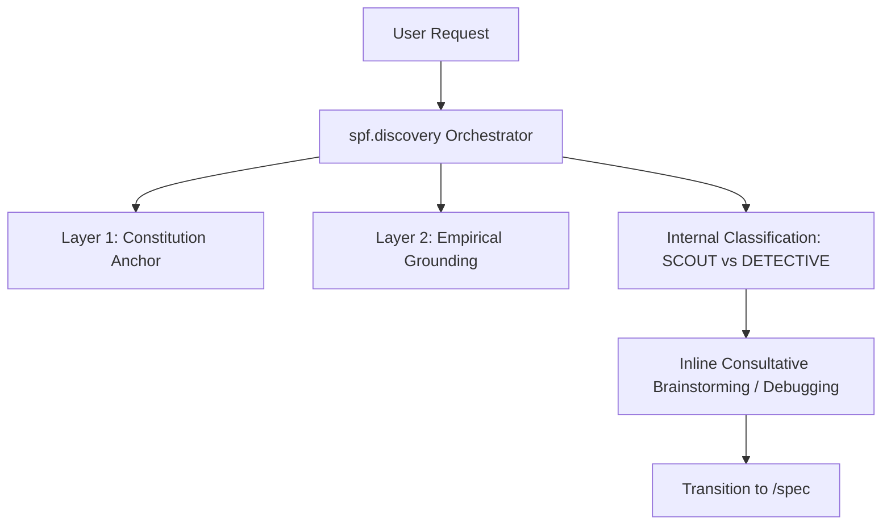

# Technical Design: Discovery Command Intelligence Refactor

## System Architecture

The Discovery phase is refactored into a single-layer **Command Intelligence** model. Instead of delegating to subagents, the `spf.discovery` command provides a robust set of instruction heuristics that the primary agent adopts to perform read-only research and brainstorming.

### Workflow Topology

## Component Definitions

### 1. `spf.discovery` Command Instructions
- **File:** `src/internal/agent/kit/commands/discovery.yaml`
- **Logic:**
    - **Dual-Mode Heuristics:** Injects both "The Scout" (feature-focused) and "The Detective" (bug-focused) personas into the command context.
    - **Funnel Integration:** Explicit steps for Constitutional alignment and Empirical grounding before any recommendation.
    - **Ghost Protocol:** Integrated ASCII wireframing standards for UI exploration.

### 2. Antigravity Synchronization
The Antigravity workflow artifacts (e.g., `.agents/workflows/spf-discovery.md`) are automatically generated from the `discovery.yaml` content during the build process (`make build`). No manual synchronization is required.

## File Inventory

| Path | Action | Description |
|------|--------|-------------|
| `src/internal/agent/kit/commands/discovery.yaml` | **Refactor** | Consolidate all discovery intelligence and heuristics. |
| `.specforce/specs/.../tasks.md` | **Refactor** | Update to reflect the removal of agent-creation and sync tasks. |

## Technical Specifications

### Intent Classification Heuristics
The agent internally adopts the required mindset based on keywords in the prompt:
- **BUG_DETECTIVE:** keywords like `bug`, `error`, `fail`, `fix`, `issue`, `regression`.
- **FEATURE_SCOUT:** default for conceptual or new feature requests.

### Read-Only Enforcement
- **Instructions:** Explicit "NON-MUTATION COVENANT" at the top of the command content.
- **Verification:** Any attempt to use mutation tools during discovery results in a workflow violation.
