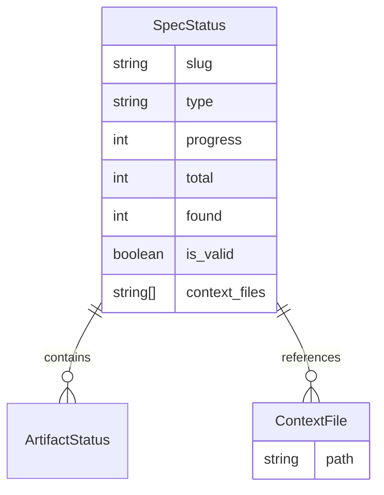

# Technical Design: Proposal.md Integration

## 1. Threat Modeling (Security-First)
*   **Discovery Write Exception:** In `spf.discovery` mode, agents are typically strictly read-only. This feature introduces a controlled mutation exception:
    *   **Permitted:** `specforce spec init <slug>` and writing to `.specforce/specs/<slug>/proposal.md`.
    *   **Authorization Gate:** The `proposal.md` must reside within the `.specforce/specs/` hierarchy. Agents MUST NOT use this exception to modify files in `src/`, `tests/`, or other sensitive directories.
*   **Input Validation:** The `specforce spec init` command must continue to validate that slugs are in `kebab-case` and do not contain path traversal characters.

## 2. Data & Persistence
*   **Storage Location:** `.specforce/specs/<slug>/proposal.md`.
*   **Schema Extension:** The `SpecStatus` structure in the Go core will be extended to track auxiliary context files.

### Mermaid Entity Relationship Diagram


## 3. API Contracts & Interfaces
The `specforce spec status --json` command will now include the `context_files` array.

**Response Schema Update:**
```json
{
  "slug": "20260530-0232-proposal-md-integration",
  "type": "feature",
  "artifacts": [...],
  "progress": 33,
  "total": 3,
  "found": 1,
  "is_valid": true,
  "context_files": [
    ".specforce/specs/20260530-0232-proposal-md-integration/proposal.md"
  ]
}
```

## 4. Surface Blueprint (Agent Instruction Updates)

### Discovery Agent (`discovery.yaml`)
The "Non-Mutation Covenant" is updated with a strict interactive gate.

```
+------------------------------------------------------------------------------+
| [PROPOSAL PROTOCOL]                                                          |
+------------------------------------------------------------------------------+
| 1. Finalize research/intelligence.                                           |
| 2. Present findings and ASK the user if they want to formalize a proposal.   |
|    - USE: 'ask_user' or equivalent.                                          |
| 3. IF CONFIRMED:                                                             |
|    ↳ Execute: specforce spec init <slug> --type <feature|bug>                |
|    ↳ Write findings to: .specforce/specs/<slug>/proposal.md                  |
| 4. IF DECLINED:                                                              |
|    ↳ Conclude research in chat and suggest /spec to proceed.                 |
+------------------------------------------------------------------------------+
```

## 5. Logic Flow & File Inventory

### [src/internal/spec/status.go] -> `SpecStatus` struct
- **Change:** Add `ContextFiles []string `json:"context_files,omitempty"`` field.

### [src/internal/spec/status.go] -> `GetStatus` function
- **Logic:**
  1. After identifying the `specDir` (either in `specs` or `archive`).
  2. Check for the existence of `proposal.md` using `os.Stat`.
  3. If present, use `filepath.Rel(projectRoot, path)` to get the relative path.
  4. Append the relative path to `status.ContextFiles`.

### [src/internal/agent/kit/commands/discovery.yaml]
- **Change:** Relax the "NON-MUTATION COVENANT" to explicitly allow `proposal.md` creation.
- **Change:** Add a "PROPOSAL PROTOCOL" section to guide agents on how to formalize findings.

### [src/internal/agent/kit/commands/spec.yaml]
- **Change:** Update "Layer 1: Constitutional Anchor" to instruct the Planning agent to check for `proposal.md` in the `context_files` metadata of the spec status.

## 6. Observability & Resilience
*   **Path Resolution:** Ensure `GetStatus` correctly handles the case where a spec has been moved to the `archive/` directory; the `proposal.md` should still be detected.
*   **Error Handling:** If `os.Stat` on `proposal.md` fails for reasons other than `NotExist`, it should be logged but not necessarily block the status report (fail-safe).
*   **Traceability:** Correlation IDs should be passed through the `GetStatus` context to trace metadata resolution in logs.
