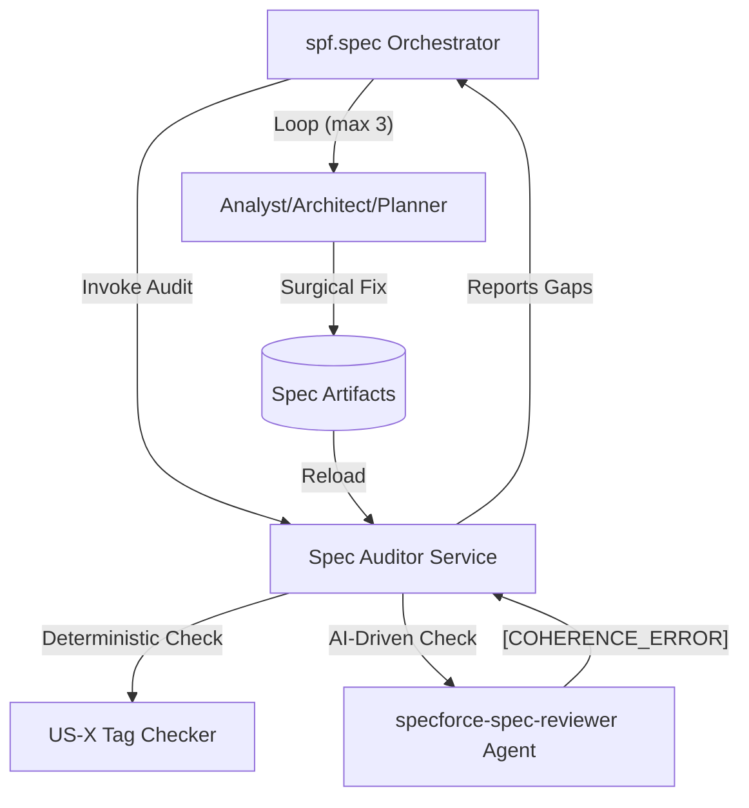
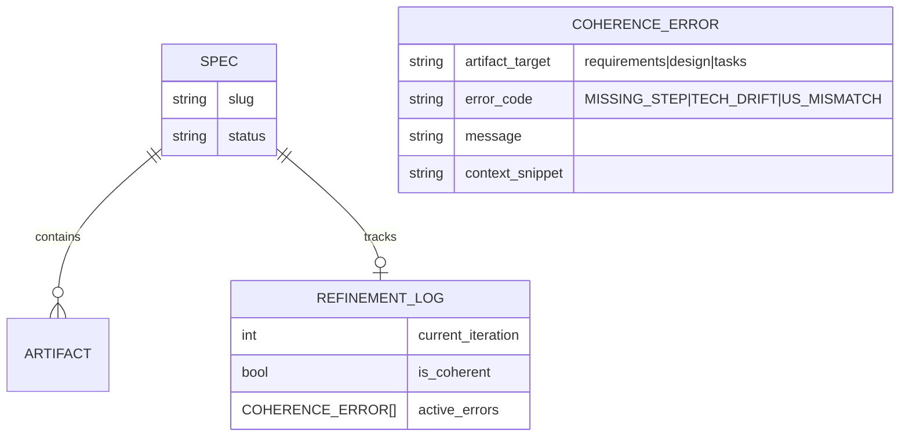

# Technical Design: Specforce Spec Reviewer

## 1. Architecture Blueprint
*A visual representation of the data flow or entity relationships for this feature.*



## 2. Persistence & Data Modeling
The `spec.Metadata` struct in `src/internal/spec/metadata.go` will be updated to track loop state in `spec.yaml`.

```go
type Metadata struct {
    // ... existing fields ...
    Refinement struct {
        IterationCount int      `json:"iteration_count" yaml:"iteration_count"`
        LastAuditAt    time.Time `json:"last_audit_at,omitempty" yaml:"last_audit_at,omitempty"`
        IsValid        bool     `json:"is_valid" yaml:"is_valid"`
        Errors         []string `json:"errors,omitempty" yaml:"errors,omitempty"`
    } `json:"refinement,omitempty" yaml:"refinement,omitempty"`
}
```

### 2.1 ER Diagram


## 3. API & Interfaces (The Contract)

### 3.1 Auditor Interface
```go
// internal/spec/auditor.go

type CoherenceError struct {
    Artifact string // Target artifact to fix
    Code     string // e.g., "MISSING_TASK"
    Message  string // Description for the agent
    Context  string // Relevant snippet from the source of truth
}

type Auditor interface {
    Audit(ctx context.Context, slug string) ([]CoherenceError, error)
    DeterministicCheck(ctx context.Context, slug string) []CoherenceError
}
```

### 3.2 Refinement Payload (Surgical Context)
When re-activating an agent, the system MUST send a specific `correction` payload:

```json
{
  "role": "planner",
  "instruction": "REFINEMENT_REQUIRED",
  "error": "[COHERENCE_ERROR] Requirement [US-3] (Surgical Correction) has no execution steps in tasks.md.",
  "source_of_truth": "## [US-3] Surgical Correction Protocol\nThe system MUST provide localized context...",
  "target_artifact_content": "... full content of tasks.md ..."
}
```

### 3.3 CLI Command: `specforce spec audit`
Used by agents to persist audit findings.

- **Usage:** `specforce spec audit <slug> [--error <msg>] [--clear] [--iteration <n>]`
- **Responsibility:** Updates the `spec.Metadata` fields in `spec.yaml`.
- **Logic:**
    - If `--clear`: sets `errors` to empty slice.
    - If `--error`: appends to `errors` slice.
    - If `--iteration`: sets `iteration_count`.

## 4. File & Component Inventory

**Backend Logic:**
- `[src/internal/spec/metadata.go]` -> [Add Refinement state fields]
- `[src/internal/spec/auditor.go]` -> [New Auditor interface and deterministic US-X validator]
- `[src/internal/spec/service.go]` -> [Implement RefineSpec loop and surgical correction logic]
- `[src/internal/tui/spec.go]` -> [Update Spec status view to display Coherence Errors and iteration count]

**Agent Kit:**
- `[src/internal/agent/kit/agents/specforce-spec-reviewer.yaml]` -> [New Agent Profile for cross-artifact auditing]
- `[src/internal/agent/kit/commands/spec.yaml]` -> [Update Phase 4 with the Refinement Loop instructions]

## 5. Threat Modeling (Security-First)
- **Iteration Hard Limit:** A strict `MAX_ITERATIONS = 3` is enforced in the Go service layer. This is non-bypassable by AI agents to prevent infinite token consumption.
- **Path Traversal Protection:** When agents are re-invoked with "surgical context," any file paths referenced must be validated using `core.SecurePath`.
- **Deterministic Halt:** If the Reviewer returns identical errors in two consecutive iterations, the loop terminates immediately and escalates to the user.

## 6. Surface Blueprint (UI-UX - TUI Ghost Protocol)

### 6.1 Refinement Progress View
```text
+------------------------------------------------------------------------------+
| [SPECFORCE] SPEC REFINEMENT LOOP: 20260602-1744-spec-refinement-loop         |
+------------------------------------------------------------------------------+
|                                                                              |
|  ITERATION 1/3                                                               |
|  ◉ Auditing artifacts...                                            [DONE]   |
|  ◉ Detected 2 Coherence Errors                                      [WARN]   |
|                                                                              |
|  ACTIVE ERRORS:                                                              |
|  ↳ [TASKS] Missing steps for [US-3] (Surgical Correction)                    |
|  ↳ [DESIGN] Drift: 'Postgres' mentioned, but tasks use 'SQLite'              |
|                                                                              |
|  REFINING:                                                                   |
|  ◉ Re-activating 'specforce-planner' for US-3...                    [WORKING]|
|  ○ Re-activating 'specforce-architect' for Design consistency...    [PEND]   |
|                                                                              |
+------------------------------------------------------------------------------+
| q: quit refinement (manual) • ctrl+c: abort                                  |
+------------------------------------------------------------------------------+
```
