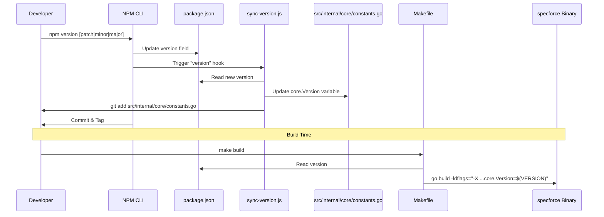

# Technical Design: Centralized Version Management

This document defines the technical architecture for centralizing version management within Specforce, establishing `package.json` as the Single Source of Truth (SSoT) and ensuring automated propagation across the Go codebase and build artifacts.

## 1. System Overview

The versioning system transitions from multiple hardcoded strings to a reactive synchronization model.



## 2. Security & Threat Modeling

### Authorization & Gates
- **Update Authorization:** Version changes are restricted to developers with write access to the repository.
- **Hook Safety:** The `version` hook is a local development lifecycle event. It does not execute during `npm install` (respecting the "Zero Scripts Policy" for end-users).

### Input Validation
- **Version Format:** The synchronization script MUST validate that the version string follows SemVer (e.g., `1.0.0-alpha.2`).
- **Path Escape:** The script uses absolute paths relative to the project root to prevent directory traversal.

## 3. Data & Persistence

### Single Source of Truth
- **Primary:** `package.json` -> `.version`
- **Go Proxy:** `src/internal/core/constants.go` -> `Version`

### Schema Changes
No database schema changes. The "schema" of the version constant in Go changes from `const` to `var` to allow Linker-space overwriting.

| File | Symbol | Type | Initial Value |
| :--- | :--- | :--- | :--- |
| `src/internal/core/constants.go` | `Version` | `var string` | Managed by sync script |

## 4. API Contracts & Interfaces

### Internal Go API
Domain packages will now consume the centralized version via the `core` package.

| Caller | Target Symbol | Change |
| :--- | :--- | :--- |
| `src/cmd/specforce/main.go` | `version` | Replace with `core.Version` |
| `src/internal/agent/registry.go` | `AgentMetadata.Version` | Replace hardcoded string with `core.Version` |
| `src/internal/tui/logo.go` | `AppVersion` | Replace hardcoded string with `core.Version` |

## 5. Surface Blueprint

N/A - This is a backend/tooling feature.

## 6. File Inventory & Contextual Anchoring

### 6.1 Modified Files

| File Path | Symbol/Section | Action |
| :--- | :--- | :--- |
| `package.json` | `scripts` | Add `"version": "node scripts/sync-version.js && git add src/internal/core/constants.go"` |
| `src/internal/core/constants.go` | `Version` | Change `const` to `var`. |
| `src/cmd/specforce/main.go` | `version` (var) | Delete local var; use `core.Version`. |
| `src/internal/agent/registry.go` | `parseAgents` | Replace hardcoded version with `core.Version`. |
| `src/internal/tui/logo.go` | `AppVersion` | Replace hardcoded version with `core.Version`. |
| `Makefile` | `build` target | Add `LDFLAGS` variable and use in `go build`. |

### 6.2 New Files

| File Path | Description |
| :--- | :--- |
| `scripts/sync-version.js` | Node.js script to read `package.json` and rewrite `src/internal/core/constants.go`. |

## 7. Observability & Resilience

### Failure Modes
- **Sync Failure:** If `sync-version.js` fails, the `npm version` command will abort, preventing inconsistent tags.
- **Linker Failure:** If `-ldflags` injection fails (e.g., wrong package path), the binary will fall back to the value defined in `src/internal/core/constants.go` (which should have been updated by the sync script anyway).

### Structured Logging
- The `sync-version.js` script MUST output `[version-sync] Updated src/internal/core/constants.go to vX.Y.Z` to stdout.

## 8. Implementation Details

### Makefile LDFLAGS Injection
```makefile
VERSION=$(shell node -p "require('./package.json').version")
LDFLAGS=-ldflags "-X github.com/jeancodogno/specforce-kit/src/internal/core.Version=$(VERSION)"

build:
	go build $(LDFLAGS) -o $(BINARY) src/cmd/specforce/main.go
```

### sync-version.js logic (Blueprint)
1. Read `package.json`.
2. Extract `version`.
3. Read `src/internal/core/constants.go`.
4. Use Regex to find `var Version = ".*"` and replace with `var Version = "<version>"`.
5. Write back to `src/internal/core/constants.go`.
