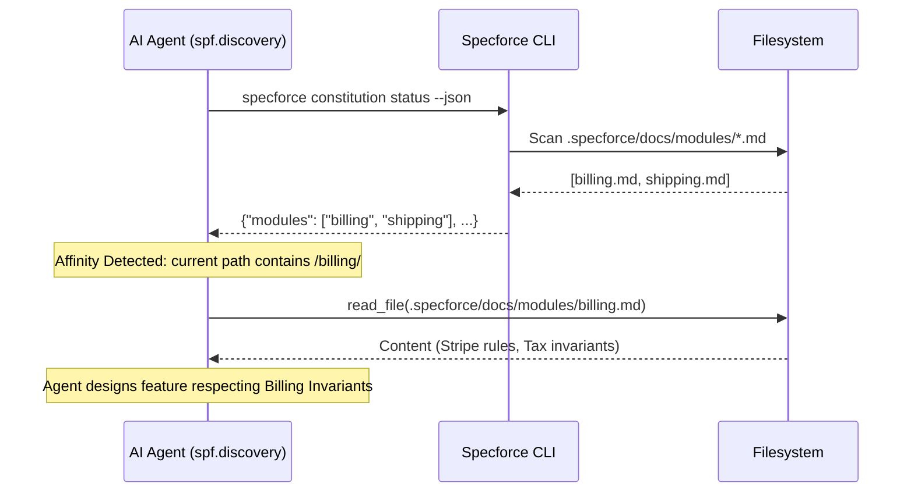
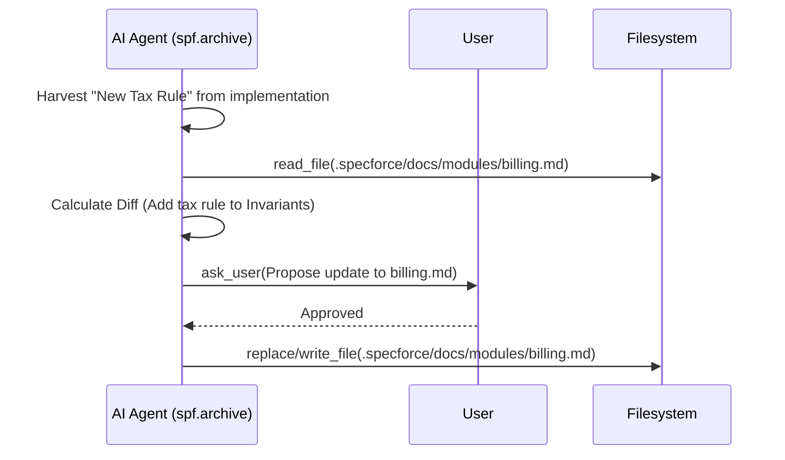

# Design: Module Manifests Support

## 1. System Architecture
The Module Manifests Support expands the Constitution domain from a flat list of global files to a two-tier hierarchy: **Global Constitution** and **Domain Modules**.

### 1.1 Discovery Mechanism
The `specforce constitution status` command is updated to perform a directory walk of `.specforce/docs/modules/`. This ensures that even if manifests are not explicitly registered in the `Registry` as core artifacts, they are still discoverable by agents via the JSON status output.

### 1.2 Lazy Load Protocol
To prevent "context explosion," agents MUST follow this protocol:
1.  **Map**: Call `specforce constitution status --json` to get the list of available modules.
2.  **Affinity Check**: Compare current task context (file paths, keywords, feature slug) against the module list.
3.  **Surgical Load**: ONLY call `read_file` for a module manifest if affinity is confirmed.
4.  **Reciprocal Archival**: During the `archive` phase, ensure harvested knowledge is funneled back into the specific module manifest identified during discovery.

## 2. Data Models & Persistence

### 2.1 Updated `ConstitutionStatus`
The core status structure is extended to include a dynamic list of discovered module slugs.

```go
// src/internal/constitution/status.go

type ConstitutionStatus struct {
    Artifacts []ArtifactStatus `json:"artifacts"` // Global artifacts
    Modules   []string         `json:"modules"`   // Discovered module slugs
    Progress  int              `json:"progress"`
    Total     int              `json:"total"`
    Found     int              `json:"found"`
}
```

### 2.2 Persistence Topology
- **Global Docs**: `.specforce/docs/*.md`
- **Module Docs**: `.specforce/docs/modules/*.md`
- **Templates**: Embedded in the binary via `src/internal/agent/artifacts/constitution/`.

## 3. API Contracts & Interfaces

### 3.1 `specforce constitution status --json`
**Response (200 OK):**
```json
{
  "artifacts": [
    {
      "name": "architecture",
      "path": ".specforce/docs/architecture.md",
      "exists": true
    }
  ],
  "modules": ["billing", "auth", "shipping"],
  "progress": 85,
  "total": 7,
  "found": 6
}
```

## 4. Surface Blueprint (ASCII Wireframe)

### 4.1 Module Manifest Template (`module.yaml`)
This template defines the high-density structure for new module manifests.

```text
+------------------------------------------------------------------------------+
| # Module: {MODULE_NAME}                                                      |
|                                                                              |
| ## 1. Domain Invariants                                                      |
| > Core business rules that are unique to this domain.                        |
| - [Invariant 1: Brief, imperative statement]                                 |
| - [Invariant 2: Focus on "MUST" and "MUST NOT"]                              |
|                                                                              |
| ## 2. Technical Patterns                                                     |
| > Domain-specific implementations, libraries, or architectural traits.       |
| - [Pattern 1: E.g., "Always use the X-Provider for Y operations"]            |
| - [Pattern 2: E.g., "Database tables must follow the Z prefix"]              |
|                                                                              |
| ## 3. Success Metrics (Local)                                                |
| - [Metric 1: Business-level KPI for this module]                             |
+------------------------------------------------------------------------------+
```

## 5. Sequence Diagrams

### 5.1 Affinity-Based Discovery


### 5.2 Lifecycle Distillation (Archive)


## 6. File Inventory

### 6.1 Core Logic
- `src/internal/constitution/status.go`: Main logic for scanning the `modules/` directory and updating the `ConstitutionStatus` struct.

### 6.2 Agent Kits & Artifacts
- `src/internal/agent/artifacts/constitution/module.yaml`: New artifact definition containing the `instruction` and `template` for modules.
- `src/internal/agent/kit/instructions/archive.md`: Updated instructions to include the "Harvest Module Invariants" step and affinity-based manifest updates.

## 7. Observability & Resilience

### 7.1 Fault Tolerance
- **Empty Directory**: If `.specforce/docs/modules/` does not exist, the CLI must return an empty `[]string` for `modules` instead of failing.
- **Malformed Manifests**: The agent must treat malformed or unreadable manifests as `status: draft` and avoid breaking the discovery loop.

### 7.2 Structured Logging
- **Discovery Trace**: Agents should log (internally) which modules were considered and why one was selected (e.g., "Module affinity detected: shipping -> /src/internal/shipping/").
