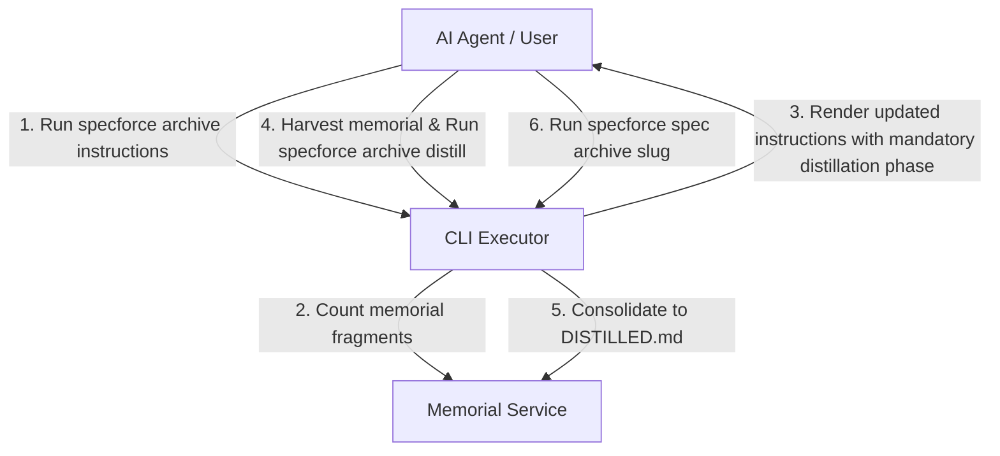

# Technical Design: Mandatory Memorial Distillation in Archival Lifecycle

## 1. Architecture Blueprint

## 2. API & Interfaces (CLI Contracts)

### `specforce archive instructions`
- **Output:** Extended Markdown instructions containing:
  - Fragment metric count (e.g. `Active Memorial Fragments: N`).
  - Mandatory Step 5/9 ordering where distillation occurs before `specforce spec archive <slug>`.

### `specforce archive distill <slugs> 
 [author]`
- **Input:** Comma-separated feature slugs, consolidated architectural summary string, optional author.
- **Side Effect:** Appends distilled summary to `.specforce/docs/memorial/DISTILLED.md` and cleans up target fragment files.

## 3. File & Component Inventory

**Backend (Go & Kit Markdown):**
- `src/internal/cli/archive.go` -> Updates `HandleArchiveInstructions` to count active fragments and output explicit distillation status/metrics.
- `src/internal/agent/kit/instructions/archive.md` -> Reorders lifecycle protocol so Memorial Harvesting & Distillation is mandatory before Archival Execution.
- `src/internal/project/memorial.go` -> Verifies fragment counting and consolidation logic.
