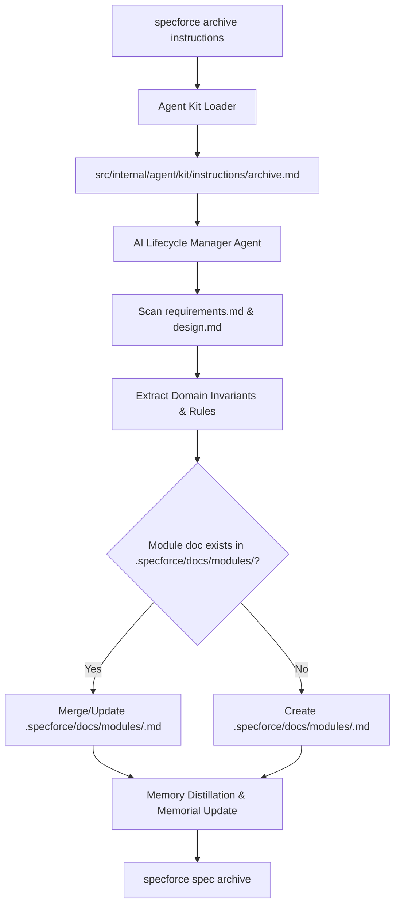

# Technical Design: Consolidation of Module Behavior on Archival

## 1. Architecture Blueprint

## 2. API & Interfaces (The Contract)

### Instruction Protocol Contract (`archive.md`)
- **Protocol Stage:** Knowledge Harvesting & Module Behavior Consolidation (Step 5 of Archival Execution Protocol).
- **Mandatory Step Sequence:**
  1. `Verification of Completion`
  2. `Dynamic Agent & Skill Discovery`
  3. `Specification Retrospective`
  4. `Constitution Impact Analysis`
  5. `Knowledge Harvesting (Memorial & Module Behavior Consolidation)` (Promoted to Mandatory Status)
  6. `Memory Distillation`
  7. `Information Gathering & Constitution Update`
  8. `Archival Execution`
  9. `Verification & Handoff` (With explicit reporting of Module Consolidation status)

## 3. File & Component Inventory

**Backend & Instructions Inventory:**
- `[src/internal/agent/kit/instructions/archive.md]` -> Update step 5 instructions to mandate module behavior consolidation and update step 9 output summary format.
- `[src/internal/agent/kit/commands/archive.yaml]` -> Update command prompt/description alignment if needed to emphasize module consolidation.
