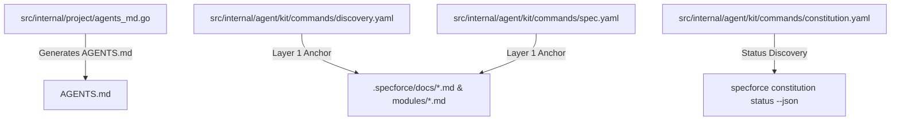

# Technical Design: Optimize Constitution and Agent Rules Guidance

## 1. Architecture Blueprint

## 2. File & Component Inventory

**Backend (Go Template & Generation):**
- `src/internal/project/agents_md.go` -> Updates `agentsMDTemplate` constant under Section 4 to include explicit guidance on `.specforce/docs/modules/<slug>.md`.
- `src/internal/project/agents_md_test.go` -> Adds unit test assertion to verify `AGENTS.md` output contains module guidance.

**Agent Kit Commands (YAML Definitions):**
- `src/internal/agent/kit/commands/discovery.yaml` -> Updates `Layer 1: Constitutional Anchor` instructions to prioritize direct file reading of `.specforce/docs/` and `modules/` instead of executing `specforce constitution status --json`.
- `src/internal/agent/kit/commands/spec.yaml` -> Updates `Layer 1: Constitutional Anchor` instructions to prioritize direct file reading of `.specforce/docs/` and `modules/` instead of executing `specforce constitution status --json`.
