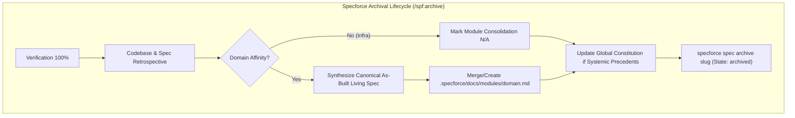

# Technical Design: Remove Memorial System and Enhance Module Living Specs

## 1. Architecture Blueprint
*Data flow and lifecycle transition for Spec Archival and Canonical Living Spec reconciliation.*



## 2. API & Interfaces (The Contract)

### CLI Command Interface Changes
- **Retained Sub-command:**
  - `specforce archive instructions`: Outputs Constitution context, core archiving rules, and custom instructions.
- **Removed Sub-commands:**
  - `specforce archive memorial <slug>` (DELETED)
  - `specforce archive distill` (DELETED)
- **Spec Lifecycle Command (Unchanged):**
  - `specforce spec archive <slug>`: Archives the completed specification from active to archived status.

### JSON Output Contract: `specforce constitution status --json`
```json
{
  "artifacts": [
    {"name": "principles", "description": "...", "path": ".specforce/docs/principles.md", "exists": true},
    {"name": "architecture", "description": "...", "path": ".specforce/docs/architecture.md", "exists": true},
    {"name": "ui-ux", "description": "...", "path": ".specforce/docs/ui-ux.md", "exists": true},
    {"name": "security", "description": "...", "path": ".specforce/docs/security.md", "exists": true},
    {"name": "engineering", "description": "...", "path": ".specforce/docs/engineering.md", "exists": true},
    {"name": "governance", "description": "...", "path": ".specforce/docs/governance.md", "exists": true}
  ],
  "modules": ["constitution", "auth"],
  "progress": 100,
  "total": 6,
  "found": 6
}
```
*(Note: `memorial` is removed from `artifacts`).*

---

## 3. File & Component Inventory

### File Deletions
- `[src/internal/project/memorial.go]` -> Delete legacy memorial service and data structures.
- `[src/internal/project/memorial_test.go]` -> Delete legacy memorial unit tests.
- `[src/internal/agent/artifacts/constitution/memorial.yaml]` -> Delete legacy memorial constitution artifact template.

### Backend Go Files
- `[src/internal/cli/archive.go]` -> `Executor.HandleArchive`: Remove `memorial` and `distill` branches. `Executor.HandleArchiveInstructions`: Remove `MemorialService` count and `MEMORIAL_FRAGMENTS` context injection. `Executor.printArchiveInstructions`: Remove memory scope and fragment count output.
- `[src/internal/cli/cobra/archive.go]` -> Remove `archiveMemorialCmd`, `archiveDistillCmd`, and associated flags.
- `[src/internal/constitution/registry.go]` -> `Registry.List`: Remove `"memorial"` from the default ordering slice.
- `[src/internal/project/bootstrapper.go]` -> `BootstrapProject`: Remove `".specforce/memorial"` from the `dirs` slice.
- `[src/internal/project/service.go]` -> `Service.InitializeProject`: Remove `NewMemorialService` and memorial initialization block.
- `[src/internal/project/agents_md.go]` -> `agentsMDTemplate`: Remove `memorial/` directory and memory harvesting references.
- `[src/internal/core/config.go]` -> `DefaultConfigContent`: Remove memorial instruction example.
- `[src/internal/spec/scanner.go]` -> `scanConstitution`: Remove legacy `entry.Name() == "memorial.md"` exclusion.

### Unit Test Files
- `[src/internal/constitution/registry_test.go]` -> `TestRegistry_NewRegistry`: Remove assertion for `memorial` artifact.
- `[src/internal/constitution/status_test.go]` -> `TestGetStatus`: Update expected total artifacts count from 7 to 6.
- `[src/internal/project/service_test.go]` -> `TestService_InitializeProject`: Remove memorial artifact setup and verification.

### Agent Kit & Artifact Templates
- `[src/internal/agent/artifacts/constitution/module.yaml]` -> Redesign template structure to include Domain Purpose, Business Rules & Invariants, Canonical Requirements & Use Cases (BDD), Technical Contracts, and Operational Invariants.
- `[src/internal/agent/artifacts/constitution/governance.yaml]` -> Remove mention of `"and propose Memorial updates"`.
- `[src/internal/agent/kit/instructions/archive.md]` -> Redesign Step 5 for As-Built Living Spec reconciliation; remove Step 6 (Memory Distillation); simplify Step 8 and Step 9 summary format.
- `[src/internal/agent/kit/commands/archive.yaml]` -> Update command description.
- `[src/internal/agent/kit/commands/constitution.yaml]` -> Rename "Memory Check" to "Context Reuse Check".
- `[src/internal/agent/kit/commands/implement.yaml]` -> Rename "Memory Check" to "Context Reuse Check".
- `[src/internal/agent/kit/commands/spec.yaml]` -> Rename "Memory Check" to "Context Reuse Check".

### Project Root & Documentation
- `[AGENTS.md]` -> Update Sections 1 and 4 to remove all references to `memorial/`.
- `[README.md]` -> Remove agent memory reference from Constitution description.
- `[docs/en/artifacts.md]`, `[docs/es/artifacts.md]`, `[docs/pt/artifacts.md]` -> Remove `memorial/` from directory structure overview.
- `[docs/en/cli.md]`, `[docs/es/cli.md]`, `[docs/pt/cli.md]` -> Remove memorial commands and references.
- `[docs/en/configuration.md]`, `[docs/es/configuration.md]`, `[docs/pt/configuration.md]` -> Clean configuration examples.
- `[docs/en/getting-started.md]`, `[docs/es/getting-started.md]`, `[docs/pt/getting-started.md]` -> Clean memorial mentions from the getting-started guide.
