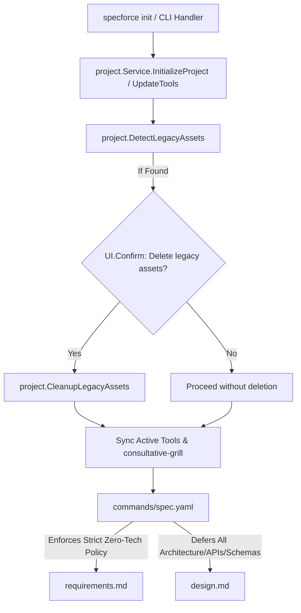

# Technical Design: Strict Business Requirements & Agent Kit Consolidation with Legacy Cleanup

## 1. Architecture Blueprint



## 2. File & Component Inventory

**Kit Resources & Prompts:**
- `src/internal/agent/kit/commands/spec.yaml` -> Add `STRICT ZERO-TECHNICAL-SPECIFICATION POLICY` to `CRITICAL RULES` and purge legacy subagent references.
- `src/internal/agent/artifacts/spec/requirements.yaml` -> Update `instruction` rule 2 and template to ban endpoints, status codes, JSON payloads, and SQL from requirements.
- `src/internal/agent/kit/kit.yaml` -> Clean up agent mappings for tools since standalone agents are deprecated.
- `src/internal/agent/kit/skills/` -> Remove `opportunity-framing/`, `pragmatic-product-owner/`, `task-atomic-decomposition/` (retaining only `consultative-grill/`).
- `src/internal/agent/kit/agents/` -> Remove all 6 legacy agent blueprint files.

**Project Service & Legacy Cleanup:**
- `src/internal/project/legacy.go` (new) -> Functions `DetectLegacyAssets(root string) ([]string, error)` and `CleanupLegacyAssets(root string, assets []string, ui core.UI) error`.
- `src/internal/project/service.go` -> Integrate legacy detection and interactive confirmation in `InitializeProject` and `UpdateTools`.
- `src/internal/project/legacy_test.go` (new) -> Unit tests for legacy detection and deletion logic.
- `src/internal/agent/compatibility_test.go` -> Update tests to test `consultative-grill` and active commands instead of deleted agents/skills.

## 3. Data Models & Logic Specifications

### Legacy Asset Identification
```go
var LegacyAgents = []string{
    "specforce-architect",
    "specforce-developer",
    "specforce-planner",
    "specforce-product-analyst",
    "specforce-qa",
    "specforce-spec-reviewer",
}

var LegacySkills = []string{
    "opportunity-framing",
    "pragmatic-product-owner",
    "task-atomic-decomposition",
}
```

Target paths scanned across tool directories (`.agents`, `.cursor`, `.claude`, `.gemini`, `.qwen`, `.opencode`, `.kilocode`, `.codex`):
- `<tool>/agents/<legacy-agent>*`
- `<tool>/skills/<legacy-skill>*`

### Orchestrator Prompt Directive
```yaml
6. **STRICT ZERO-TECHNICAL-SPECIFICATION POLICY:** Requirements MUST contain exclusively business rules, end-user personas, and BDD acceptance criteria (focusing purely on 'What' and 'Why'). DO NOT include technical implementation details, code, specific endpoints/URLs, library names, database schemas, or technical parsing mechanisms in requirements.md. All technical implementation details belong strictly in design.md.
```
