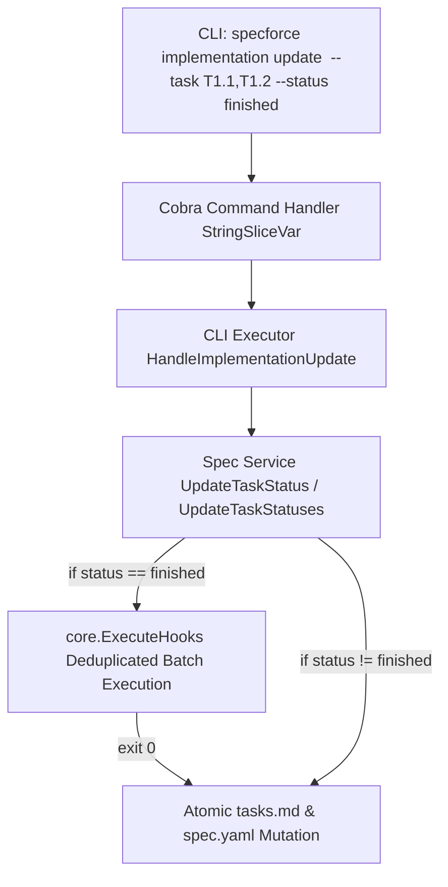

# Technical Design: Batch Task Update & Subagent Orchestration

## 1. Architecture Blueprint

## 3. API & Interfaces (The Contract)

### CLI Command Interface
- **Command:** `specforce implementation update <slug> --task <id1,id2,...> --status <status>`
- **Flags:**
  - `--task` (StringSlice): One or more task identifiers. Supports comma-delimited strings (`--task T1.1,T1.2`) and repeated flags (`--task T1.1 --task T1.2`).
  - `--status` (String): Target state (`in-progress`, `finished`, `pending`, `failed`).
- **Success Output:** `[OK] Tasks <task-ids> status updated to <status> in <slug>`
- **Error Outputs:**
  - `task <task-id> not found in tasks.md` (exit code 1)
  - `[HOOK FAILURE] ... update aborted.` (exit code 1)

### Go Interface Contracts
- **`src/internal/cli/implementation.go`**:
  `HandleImplementationUpdate(ctx context.Context, ui core.UI, slug string, taskIDs []string, status string) error`
- **`src/internal/spec/service.go`**:
  `UpdateTaskStatus(ctx context.Context, projectRoot, slug string, taskIDs []string, status string) error`
- **`src/internal/spec/tasks.go`**:
  `updateTaskStatusesFile(projectRoot, slug string, taskIDs []string, newStatus string) error`

## 4. File & Component Inventory

**Backend & CLI Packages:**
- `[src/internal/cli/cobra/implementation.go]` -> `implementationUpdateCmd`, `taskIDs []string` flag declaration with `StringSliceVar`.
- `[src/internal/cli/implementation.go]` -> `HandleImplementationUpdate` supporting `[]string` task IDs.
- `[src/internal/spec/service.go]` -> `UpdateTaskStatus`, `collectHooksForTasks` with deduplication and phase/spec hook detection across all batch tasks.
- `[src/internal/spec/tasks.go]` -> `updateTaskStatusesFile`, multi-task block validation, atomic content mutation, batch metadata session tracking.
- `[src/internal/spec/tasks_test.go]` -> Unit tests for batch task status updates, atomic rollback on invalid task ID, and session time tracking.
- `[src/internal/cli/implementation_test.go]` -> CLI integration tests verifying `--task T1.1,T1.2` parsing, single-run hook execution, and output formatting.

**Agent Kit Blueprints:**
- `[src/internal/agent/kit/commands/implement.yaml]` -> Blueprint instructions updated with batch CLI command syntax, subagent sizing guidelines (1 for small, 2-3 sweet spot, up to 4 for complex), mandatory subagent usage rule, and strict prohibition on subagents editing `tasks.md` directly.
