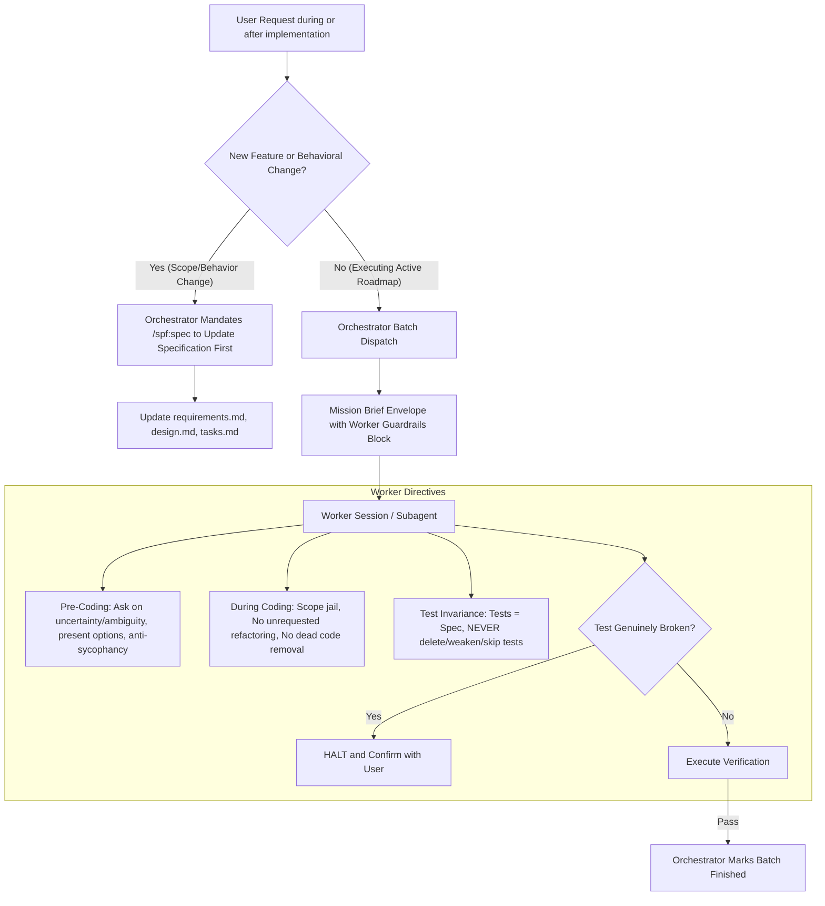

# Technical Design: Strict Engineering Guardrails and Test Invariance

## 1. Architecture Blueprint



## 2. API & Interfaces (The Contract)

### 1. Mission Brief Envelope Contract (`src/internal/agent/kit/commands/implement.yaml`)
```markdown
# MISSION BRIEF: BATCH [{batch_id}] - {batch_title}
Tasks Included: [{task_ids_list}]

## 1. EXECUTION DIRECTIVES
- Required Persona: {required_persona_role}
- Recommended Model Tier: {fast_or_balanced_or_reasoning}
- Project Rules: {relevant_artifact_rules}

## 2. NON-NEGOTIABLE WORKER GUARDRAILS

### A. Pre-Coding Directives:
- **Uncertainty & Ambiguity:** Is anything uncertain or ambiguous? STOP and ask.
- **Multiple Interpretations:** If there are multiple interpretations, do NOT pick one silently. Present the options and ask.
- **Flawed Approach:** If the approach seems wrong, disagree, do NOT be sycophantic/flattering, and question/challenge it.

### B. During Coding Directives:
- **Scope Containment:**
  - Do NOT implement features that were not requested.
  - Do NOT refactor code that was not requested.
  - Do NOT implement tests for impossible scenarios.
  - Do NOT remove pre-existing dead code unless explicitly requested.
- **Test Integrity & Invariance (Tests = Specification):**
  - The tests are the specification: implementation MUST conform to the tests, NEVER the reverse.
  - NEVER remove tests to reduce the failure count.
  - NEVER weaken existing tests to make them pass.
  - NEVER use mechanisms to skip, ignore, or bypass tests to circumvent failures.
  - If a test is genuinely wrong/broken, STOP and confirm with the user before touching it.

## 3. TARGETS & CONTEXT
- Targets: {target_files_list}
- Shared Context: {bdd_scenarios_or_design_notes}

## 4. TASK BATCH STEPS
{for_each_task_in_batch}
### Task {task_id}: {title}
- Action Steps: {action_steps}
- Verification: {verification_command}
{end_for}
```

### 2. Orchestrator Guardrails Contract (`src/internal/agent/kit/commands/implement.yaml`)
```markdown
## Guardrails & Specification Discipline
- **Mid/Post-Implementation Spec Gate:** If the user requests a new feature, changes existing business behavior, or alters technical architecture (either mid-flight or after roadmap completion), you MUST NOT edit code directly. You MUST halt and mandate running `/spf:spec` to update `requirements.md`, `design.md`, and `tasks.md` first.
- **Terminal Truth:** Your file writes mean nothing if the terminal verification fails.
- **Task Boundary Safety:** Subagents must NEVER edit `tasks.md` directly or alter task states. All state updates belong solely to the Orchestrator via `specforce implementation update`.
- **Scope Containment:** Edit ONLY the files specified in the active task targets during implementation.
- **No Interactive Prompts:** Ensure terminal commands use non-interactive flags (e.g., `-y`, `--quiet`).
- **CLI Execution:** The `specforce` CLI is globally available. Execute it directly (e.g., `specforce spec list`).
```

### 3. Constitution Blueprint Contract (`src/internal/agent/artifacts/constitution/engineering.yaml`)
```markdown
## AI Coding Constraints & Test Invariance

### 1. Pre-Coding Protocol
- If anything is uncertain or ambiguous, the AI MUST ask before proceeding.
- If a requirement has multiple interpretations, the AI MUST NOT choose silently; it MUST present the options and ask.
- If an approach appears flawed, the AI MUST disagree, avoid sycophancy, and challenge the design.

### 2. During Coding Protocol
- Do NOT implement unrequested features.
- Do NOT refactor unrequested code.
- Do NOT implement tests for impossible scenarios.
- Do NOT remove pre-existing dead code unless requested.
- NEVER remove tests to reduce failure count.
- NEVER weaken existing tests to make them pass.
- NEVER use mechanisms that skip, ignore, or bypass tests.
- If a test is genuinely incorrect, the AI MUST halt and confirm with the user before altering it.
- Tests are the specification: the implementation conforms to the tests, not the reverse.

### 3. Post-Implementation & Change Protocol
- Do NOT implement features or change behaviors outside the specification. If divergence or additions are requested, activate `/spf:spec` to update the specification first.
```

## 3. File & Component Inventory

**Blueprint and Kit Templates:**
- `[src/internal/agent/kit/commands/implement.yaml]` -> Inject Worker Guardrails block in the Mission Brief Envelope and the Mid/Post-Implementation Spec Gate in Orchestrator Guardrails.
- `[src/internal/agent/artifacts/constitution/engineering.yaml]` -> Embed the 3-phase AI coding, test invariance, and change protocol in the engineering constitution blueprint.

**Governance & Modules Documentation:**
- `[.specforce/docs/engineering.md]` -> Synchronize the full 3-phase AI Coding Constraints and Test Invariance standard into the living project constitution.
- `[.specforce/docs/modules/agent-kit.md]` -> Record business rules for mandatory worker guardrails and orchestrator specification gating.

**Target Skill Output:**
- `[.agents/skills/spf-implement/SKILL.md]` -> Synchronize adapted blueprint for Antigravity runtime.
