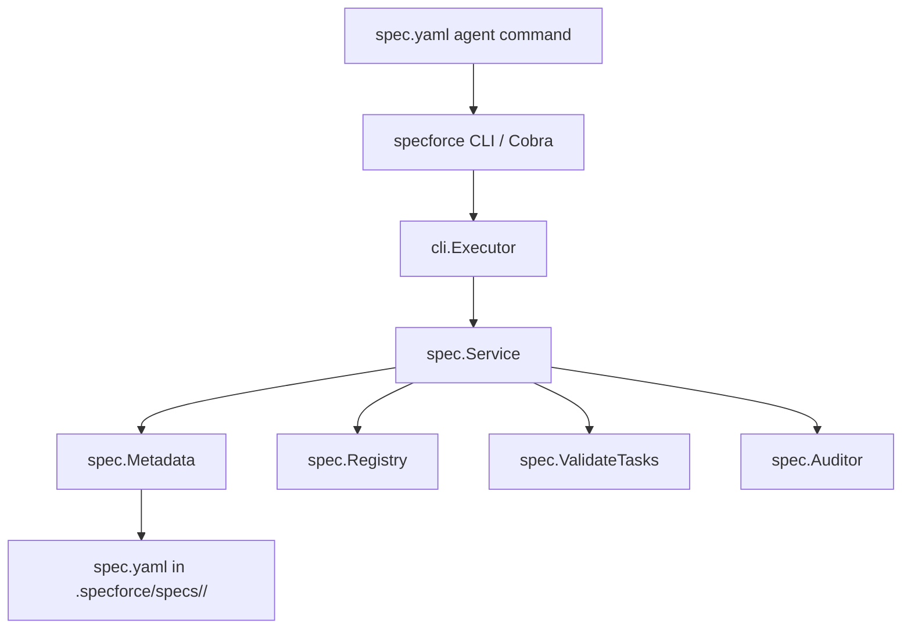

# Technical Design: Tiered Spec Sizing & Dynamic Lifecycle Transitions

## 1. Architecture Blueprint



## 2. Persistence & Data Modeling

### Metadata Updates (`src/internal/spec/metadata.go`)
Extend `Metadata` struct with the `Size` field:

```go
type SpecSize string

const (
    SpecSizeSmall   SpecSize = "small"
    SpecSizeMedium  SpecSize = "medium"
    SpecSizeLarge   SpecSize = "large"
    SpecSizeComplex SpecSize = "complex"
)

type Metadata struct {
    Slug       string                 `json:"slug" yaml:"slug"`
    Name       string                 `json:"name" yaml:"name"`
    Type       string                 `json:"type" yaml:"type"` // "feature" | "bug"
    Size       SpecSize               `json:"size" yaml:"size"` // "small" | "medium" | "large" | "complex"
    TimeLogs   map[string]TaskTimeLog `json:"time_logs,omitempty" yaml:"time_logs,omitempty"`
    Refinement RefinementMetadata     `json:"refinement,omitempty" yaml:"refinement,omitempty"`
}
```

- Default size on initialization when unspecified: `SpecSizeMedium` ("medium").
- Backward compatibility: If `size` is empty in `LoadMetadata`, assign `SpecSizeMedium`.

## 3. API & Interfaces (The Contract)

### CLI Command 1: `spec init` with `--size` flag
- **Command:** `specforce spec init <slug> [--type feature|bug] [--size small|medium|large|complex] [--json]`
- **Arguments:**
  - `slug`: required identifier
  - `--type`: `feature` (default) or `bug`
  - `--size`: `small`, `medium` (default), `large`, `complex`
- **Output JSON (`200 OK` structure):**
```json
{
  "status": "ok",
  "message": "Spec directory initialized: .specforce/specs/20260825-1410-tiered-spec-sizing",
  "type": "feature",
  "size": "small"
}
```

### CLI Command 2: `spec resize`
- **Command:** `specforce spec resize <slug> --size <small|medium|large|complex> [--json]`
- **Behavior:**
  - Validates slug existence in active specs.
  - Updates `size` field in `spec.yaml`.
  - Recalculates required artifacts.
- **Output JSON:**
```json
{
  "status": "ok",
  "slug": "20260825-1410-tiered-spec-sizing",
  "previous_size": "small",
  "size": "large",
  "message": "Specification resized from small to large"
}
```

### Dynamic Artifact Matrix Resolution (`src/internal/spec/registry.go` & `status.go`)
Function `GetRequiredArtifacts(specType string, size SpecSize) []string`:
- `small`: `["tasks"]` (or `["bug-tasks"]`)
- `medium`: `["requirements", "tasks"]` (or `["bug-requirements", "bug-tasks"]`)
- `large`: `["requirements", "design", "tasks"]` (or `["bug-requirements", "bug-design", "bug-tasks"]`)
- `complex`: `["requirements", "design", "tasks"]`

### Task Validation Rules (`src/internal/spec/tasks.go`)
`ValidateTasksWithSize(ctx context.Context, projectRoot, slug string, size SpecSize) ([]string, error)`:
- If `size == SpecSizeSmall`:
  - Allow 1+ action steps (remove `>= 2` failure if count is 1).
  - Do not fail if `**Context:** [US-X]` is omitted.
  - Still enforce task ID structure (`- [ ] T1.1: ...`) and mandatory `**Acceptance Check:**`.
- If `size != SpecSizeSmall`:
  - Retain existing strict checks: minimum 2 action steps, mandatory `**Context:** [US-X]`, and acceptance checks.

### Auditor Rules (`src/internal/spec/auditor.go`)
- In `DeterministicCheck(ctx context.Context, slug string)`:
  - Read `Metadata` to check `Size`.
  - If `Size == SpecSizeSmall` and `requirements.md` does not exist on disk, skip `FILE_MISSING` and skip cross-referencing US tags.

## 4. File & Component Inventory

**Backend (Go CLI Core):**
- `[src/internal/spec/metadata.go]` -> Add `SpecSize` type, `Size` field in `Metadata`, validation helpers, default fallback.
- `[src/internal/spec/registry.go]` -> Add `ListForTypeAndSize(specType string, size SpecSize) []Artifact` supporting conditional artifact requirements.
- `[src/internal/spec/status.go]` -> Update `GetStatus` and `processAllArtifacts` to use size-aware artifact lists.
- `[src/internal/spec/tasks.go]` -> Update `ValidateTasks` to load metadata size and apply relaxed density / context rules for `small`.
- `[src/internal/spec/auditor.go]` -> Update `DeterministicCheck` to respect `small` specs without `requirements.md`.
- `[src/internal/cli/spec.go]` -> Add `HandleSpecResize`, add `--size` parsing in `handleSpecInitCmd` and `HandleSpecInit`.
- `[src/internal/cli/cobra/spec.go]` -> Register `specResizeCmd` and `--size` flag on `specInitCmd` and `specResizeCmd`.
- `[src/internal/spec/service.go]` -> Add `ResizeSpec(ctx context.Context, slug string, size SpecSize) error`.

**Agent Kit Prompt & Command:**
- `[src/internal/agent/kit/commands/spec.yaml]` -> Update execution protocol with pre-flight size classification, tiered grill skipping for `small`, and `spec resize` workflow.
