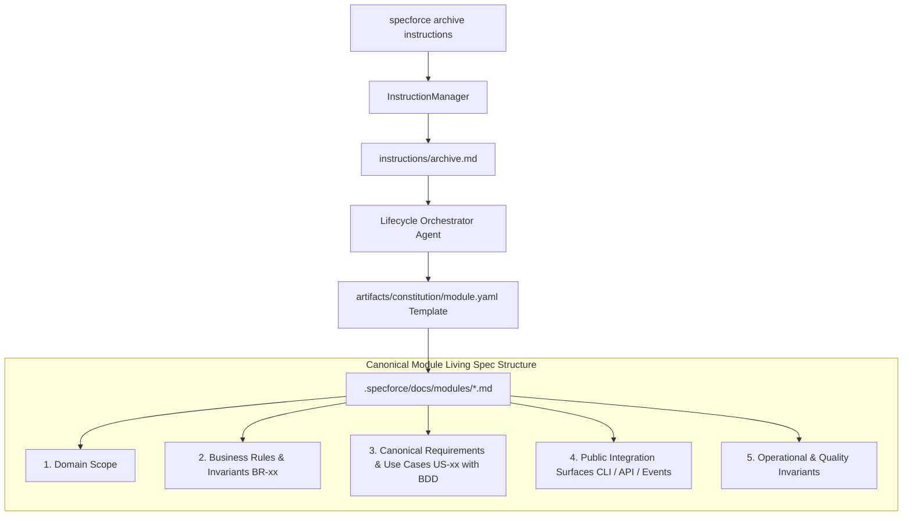

# Technical Design: Standardize Module Living Specifications as Behavioral BDD Specs

## 1. Architecture Blueprint

## 2. API & Interfaces (The Contract)

### CLI Instruction Contract
- **Command:** `specforce archive instructions`
- **Output Channel:** Stdout Markdown
- **Contract Change:** Instruction step 5 explicitly mandates BDD behavioral use case synthesis, domain invariant updates, public integration contracts, opportunistic legacy module migration (reformatting legacy structure and removing low-level code dumps on merge), and strictly forbids internal implementation files, internal package listings, or private method signatures.

### Module Blueprint Schema Contract
- **Template ID:** `constitution/module.yaml`
- **Output Target:** `.specforce/docs/modules/<slug>.md`
- **Section Schema:**
  1. `## 1. Domain Scope`
  2. `## 2. Business Rules & Invariants` (Numbered domain rules `[BR-XX]`)
  3. `## 3. Canonical Requirements & Use Cases` (Numbered use cases `[US-XX]` with GIVEN/WHEN/THEN scenarios for happy path and edge cases)
  4. `## 4. Public Integration Surfaces & Contracts` (Public CLI commands, public APIs, event topics, inter-module interfaces)
  5. `## 5. Operational & Quality Invariants` (SLAs, security, persistence invariants)

## 3. File & Component Inventory

**Embedded Kit Blueprints & Instructions:**
- `src/internal/agent/kit/instructions/archive.md` -> Lifecycle Manager instructions for Step 5 (Living Spec Reconciliation) and Guardrails against low-level code detail dumps.
- `src/internal/agent/artifacts/constitution/module.yaml` -> Canonical module template and generation instructions enforcing BDD scenarios and public integration surfaces.

**Canonical Project Module Documentation:**
- `.specforce/docs/modules/agent-kit.md` -> Sanitize Section 4 to list public CLI contracts and module interaction surfaces without internal Go package paths.
- `.specforce/docs/modules/constitution.md` -> Ensure adherence to the 5-part canonical behavioral living spec standard.
- `.specforce/docs/modules/spec-management.md` -> Sanitize Section 4 to list public CLI contracts and state management surfaces without internal package paths.

**Tests & Validation:**
- `src/internal/agent/kit_manifests_test.go` -> Ensure embedded kit YAMLs and instructions validate cleanly.
- `src/internal/core/config_test.go` -> Validate suite integrity.
