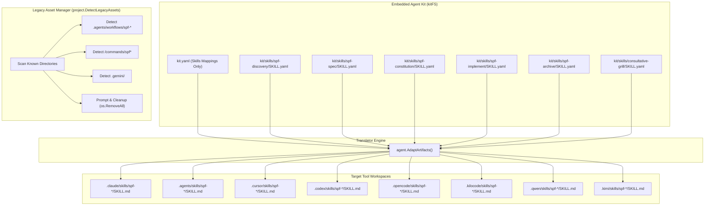

# Technical Design: Pure Skills Agent Kit & Legacy Decommissioning

## 1. Architecture Blueprint



## 2. Blueprint & Mapping Contracts

### Unified `kit.yaml` Schema
```yaml
defaults:
  skills:
    path: "skills"
    name: "SKILL"
    ext: ".md"

tools:
  claude:
    name: "Claude"
    description: "Anthropic's Claude agent integration."
    target: ".claude/"
    mappings:
      skills:
        - path: "skills"
          name: "SKILL"
          ext: ".md"

  antigravity:
    name: "Antigravity"
    description: "Antigravity workflow integration."
    target: ".agents/"
    mappings:
      skills:
        - path: "skills"
          name: "SKILL"
          ext: ".md"

  cursor:
    name: "Cursor"
    description: "Cursor AI Editor integration."
    target: ".cursor/"
    mappings:
      skills:
        - path: "skills"
          name: "SKILL"
          ext: ".md"

  qwen:
    name: "Qwen"
    description: "Alibaba's Qwen agent integration."
    target: ".qwen/"
    mappings:
      skills:
        - path: "skills"
          name: "SKILL"
          ext: ".md"

  open-code:
    name: "OpenCode"
    description: "OpenCode agent integration."
    target: ".opencode/"
    mappings:
      skills:
        - path: "skills"
          name: "SKILL"
          ext: ".md"

  kilo-code:
    name: "KiloCode"
    description: "KiloCode agent integration."
    target: ".kilocode/"
    mappings:
      skills:
        - path: "skills"
          name: "SKILL"
          ext: ".md"

  codex:
    name: "Codex"
    description: "Codex agent integration."
    target: ".codex/"
    security:
      global_write: true
    mappings:
      skills:
        - path: "skills"
          name: "SKILL"
          ext: ".md"

  kimi-code:
    name: "Kimi Code"
    description: "Moonshot AI's Kimi Code CLI agent."
    target: ".kimi/"
    mappings:
      skills:
        - path: "skills"
          name: "SKILL"
          ext: ".md"
```

### Legacy Detection Rules (`src/internal/project/legacy.go`)
- Add scan targets:
  1. `.agents/workflows` (directory or any child `spf-*.md` files).
  2. `<tool>/commands` (e.g. `.claude/commands`, `.cursor/commands`, `.opencode/commands`, `.kilocode/commands`).
  3. `.gemini` (entire folder in repository root).
  4. Deprecated prompts in Codex prompts directory if configured.

### Decommissioning Scope:
- Remove `.gemini/` from `core.ToolPrefixes`.
- Remove `transformers[".toml"]` in `src/internal/agent/translator.go`.
- Remove Gemini settings handler in `src/internal/project/agents_md.go` (`ensurePlatformConfigs`).

## 3. File & Component Inventory

### Core & Kit Blueprints
- `[src/internal/core/constants.go] -> ToolPrefixes`: Remove `".gemini/"`.
- `[src/internal/agent/kit/kit.yaml]`: Remove `gemini-cli` entry, replace all `commands:` mappings with unified `skills:` mappings.
- `[src/internal/agent/kit/commands/*] -> [DELETED]`: Remove `archive.yaml`, `constitution.yaml`, `discovery.yaml`, `implement.yaml`, `spec.yaml`.
- `[src/internal/agent/kit/skills/spf-archive/SKILL.yaml] -> [NEW]`: Converted archive skill blueprint.
- `[src/internal/agent/kit/skills/spf-constitution/SKILL.yaml] -> [NEW]`: Converted constitution skill blueprint.
- `[src/internal/agent/kit/skills/spf-discovery/SKILL.yaml] -> [NEW]`: Converted discovery skill blueprint.
- `[src/internal/agent/kit/skills/spf-implement/SKILL.yaml] -> [NEW]`: Converted implement skill blueprint.
- `[src/internal/agent/kit/skills/spf-spec/SKILL.yaml] -> [NEW]`: Converted spec orchestration skill blueprint.

### Translation & Platform Logic
- `[src/internal/agent/translator.go] -> transformers`: Remove `.toml` transformer map entry.
- `[src/internal/project/agents_md.go] -> ensurePlatformConfigs`: Remove `.gemini/settings.json` writer.
- `[src/internal/project/agents_md.go] -> agentsMDTemplate`: Update text to describe Specforce Skills protocol instead of legacy command/workflow phrasing.
- `[src/internal/project/legacy.go] -> DetectLegacyAssets`: Add detection logic for obsolete workflows, commands, and `.gemini`.
- `[src/internal/project/legacy.go] -> KnownToolDirs`: Remove `.gemini` from standard tools and route to legacy detection.

### Governance & Verification
- `[.specforce/docs/modules/agent-kit.md]`: Update `[BR-KIT-01]` and requirements to reflect 100% pure skills architecture.
- `[src/internal/agent/compatibility_test.go]`: Update test cases to verify skills output rather than commands.
- `[src/internal/agent/kit_manifests_test.go]`: Update test paths from `kit/commands/` to `kit/skills/`.
- `[src/internal/project/legacy_test.go]`: Add test coverage for detection and cleanup of workflows, commands, and `.gemini`.
- `[src/internal/installer/installer_test.go]`: Update paths to assert against skills instead of workflows/commands.
