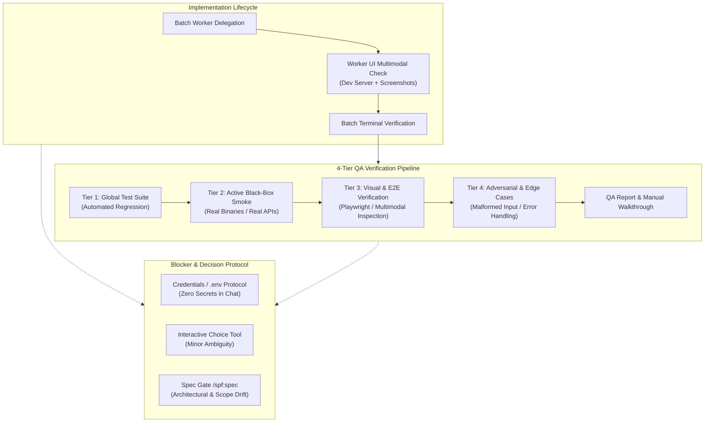

# Technical Design: Active QA, Multimodal UI Verification & Blocker Protocol

## 1. Architecture Blueprint

## 3. API & Interfaces (The Contract)

### Implementation Skill (`spf-implement`) Blueprint Contract

#### A. Worker Guardrails (Mission Brief Envelope)
- **UI & Visual Verification Directive:**
  - When tasks modify frontend or visual interfaces, the worker must run the local dev server/preview, trigger headless browser/screenshot capture tools (Playwright/Puppeteer/scripts), inspect screenshots via multimodal vision, and verify visual alignment with `ui-ux.md` and design specifications.
- **Active Smoke Testing Directive:**
  - Workers must perform real execution of the modified artifact (not relying exclusively on mock-based unit tests) prior to concluding batch implementation.

#### B. 4-Tier QA Verification Protocol (Step 4)
- **Tier 1 (Automated Regression):** Execute `{project_test_command}`. Exit code 0 required.
- **Tier 2 (Active Black-Box Smoke Testing):** Build real binary/artifact (e.g., `go build`, `npm run build`), execute real CLI commands with real flags or real HTTP/API requests, and verify exit codes and disk artifacts against `requirements.md`.
- **Tier 3 (Visual & E2E UI Verification):** If UI is present, execute E2E/browser flows, capture screenshots of key flows and responsive states, and visually verify layout and styling.
- **Tier 4 (Adversarial & Robustness Testing):** Execute invalid/boundary arguments to confirm graceful error handling without panics or unhandled exceptions.

#### C. Human-in-the-Loop & Blocker Protocol
- **Zero Plaintext Secrets:** Prohibit soliciting secrets in chat. Instruct `.env` configuration and update `.env.example`.
- **Interactive Question Protocol:** For minor ambiguities within scope, invoke environment interactive question tools with structured trade-offs.
- **Mid-Implementation Spec Gate:** For scope additions or architectural changes, halt and mandate running `/spf:spec`.

## 4. File & Component Inventory

**Skill Blueprints & Module Specifications:**
- `[src/internal/agent/kit/skills/spf-implement/SKILL.yaml]` -> Updates implementation orchestrator blueprint with multimodal UI directives, 4-Tier QA verification protocol, and human-in-the-loop blocker/credentials protocol.
- `[.specforce/docs/modules/agent-kit.md]` -> Updates Agent Kit living specification with new business rules (`[BR-KIT-12]`, `[BR-KIT-13]`, `[BR-KIT-14]`) and canonical use cases for active QA, visual UI validation, and blocker management.
